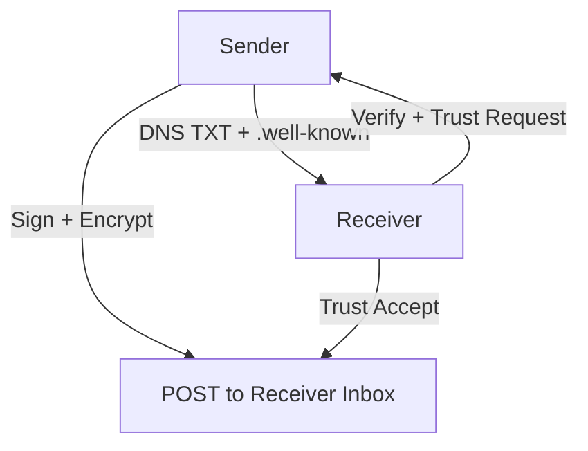

# BTPS Architecture

**Status:** Alpha | **License:** MIT | **Type:** Federated Open Protocol

---

## Visual Protocol Flow



Or, as ASCII:

```
┌────────────┐      DNS TXT + .well-known       ┌─────────────┐
│  Sender    │  ─────────────────────────────▶  │  Receiver   │
│            │     (Verify + Trust Request)     │             │
└────────────┘ ◀─────────────────────────────── └─────────────┘
       │                   ▲
       ▼                   │
    [Sign + Encrypt]   [Trust Accept]
       │                   ▼
       └──────▶  POST to Receiver Inbox
```

---

## Overview

The Billing Transport Protocol (BTP) is an open protocol for securely delivering billing payloads (invoices, statements, financial documents) across domains using DNS + HTTPS + cryptographic signing. It enables senders to address recipients using a familiar format like:

```
john$company.com
```

and securely deliver structured billing messages **only after explicit consent** from the recipient.

---

## ✨ Key Concepts

| Concept             | Description                                                       |
| ------------------- | ----------------------------------------------------------------- |
| `btp-address`       | Like email, but uses `$`: e.g. `finance$company.com`              |
| `.well-known` Trust | Trust records published at `/.well-known/btp-trust.json`          |
| DNS Discovery       | TXT records used to verify public keys and protocol support       |
| Consent Handshake   | Sender must initiate a trust request, and be approved             |
| Signed Delivery     | All messages are signed + encrypted using public key cryptography |
| Optional Inbox      | Self-hosted or SaaS-based inbox endpoints handle delivery         |

---

## Protocol Flow: Step by Step

1. **Discovery**  
   Sender does a DNS TXT lookup for:  
   `_btp.finance.vendor.com`  
   Retrieves public key and protocol support.

2. **Request Consent**  
   Sender creates a signed handshake request and sends it to the receiver.

3. **Receiver Accepts or Rejects**

   - If accepted, receiver adds sender to `btp-trust.json`
   - If rejected, no messages are allowed

4. **Message Delivery**  
   Only after trust is established can sender post signed+encrypted messages to receiver's inbox.

5. **Revocation**  
   Receiver can revoke trust any time by updating `.well-known/btp-trust.json`

---

## Trust Registry (Lightweight)

Instead of using a database, vendors may publish a public trust ledger:

```
/.well-known/btp-trust.json
```

Example:

```json
{
  "trustedSenders": {
    "finance@supplier.com": {
      "status": "accepted",
      "trustedAt": "2025-05-28T02:01:30Z",
      "expiresAt": "2026-05-28T00:00:00Z"
    },
    "hr@supplier.com": {
      "status": "revoked"
    }
  }
}
```

---

## About `.well-known` Trust Storage

The `.well-known` directory is designed for simple or self-hosted BTPS servers. By default, trust records are stored as a JSON file (`btp-trust.json`) inside the `.well-known` directory. This approach is ideal for small vendors or those who want zero-infrastructure, file-based trust management.

For larger organizations or advanced deployments, BTPS supports pluggable trust storage. You can implement your own TrustStore backend by extending the `AbstractTrustStore` class provided by the SDK. This allows you to connect to any database system you prefer (e.g., MongoDB, SQL, cloud storage) by implementing the required methods for trust management.

- **Simple/self-hosted:** Use `.well-known/btp-trust.json` (default)
- **Enterprise/advanced:** Implement a custom TrustStore (e.g., database-backed) by extending `AbstractTrustStore`

This flexibility ensures BTPS can scale from static file hosting to full enterprise integration.

---

## 📥 Optional Inbox Explained

BTPS is a true TLS protocol, not HTTPS. Vendors are not required to host their own inbox services, but have several integration options:

- **Native BTPS Inbox (TLS):**

  - Run a BTPS server that listens for incoming protocol messages over TLS.
  - This is the most secure and direct way to receive BTPS messages.

- **Forwarding to HTTPS/Webhook:**

  - The BTPS server can be configured to forward received messages to an HTTPS endpoint or webhook.
  - This is useful for SaaS apps or platforms that want to process messages using standard HTTP APIs.

- **Direct Database/Queue Integration:**

  - Using middleware, `.onMessage`, or `.onError` hooks, you can connect directly to a database (e.g., MongoDB, SQL) or a message queue (e.g., AWS SQS) to store messages or update trust records.
  - This allows for advanced, real-time integrations and custom workflows.

- **Static Identity Only:**
  - Vendors may choose to only publish DNS TXT and `.well-known` records for identity and trust, without running a live inbox.
  - In this mode, only handshake requests can be received; no messages are delivered unless a valid inbox is resolved.

This architecture ensures maximum flexibility: small vendors can use zero-infrastructure static files, while enterprises can build fully integrated, real-time systems with direct database, queue, or webhook connectivity—all secured by the BTPS protocol over TLS.

### 🔧 Integration Examples (Middleware Style)

> These are high-level middleware handler snippets. See [SERVER.md](./SERVER.md) for full configuration and advanced usage.

**1. Forwarding to HTTPS/Webhook**

```js
// Middleware handler
async (req, res, next) => {
  await fetch('https://your-app.com/btps-inbox', {
    method: 'POST',
    headers: { 'Content-Type': 'application/json' },
    body: JSON.stringify(req.artifact),
  });
  await next();
};
```

**2. Direct Database Integration**

```js
// Middleware handler
async (req, res, next) => {
  await db.collection('btps_messages').insertOne(req.artifact);
  await next();
};
```

**3. SQS/Queue Integration**

```js
// Middleware handler
async (req, res, next) => {
  await sqs.send(
    new SendMessageCommand({
      QueueUrl: process.env.SQS_URL,
      MessageBody: JSON.stringify(req.artifact),
    }),
  );
  await next();
};
```

You can implement these integrations in any middleware phase, `.onMessage`, or `.onError` for maximum flexibility.

---

## 🏁 Goals

- Reduce spam and unauthorized billing messages
- Enable federated, DNS-based identity without central authority
- Support SaaS and self-hosted workflows

---

## License

MIT — Open to all contributors committed to consent-first, privacy-safe infrastructure.
