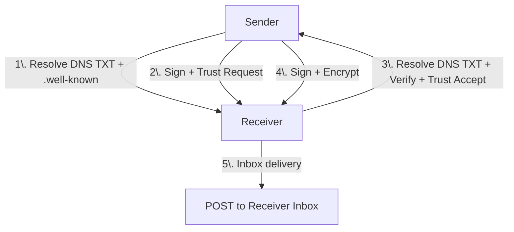
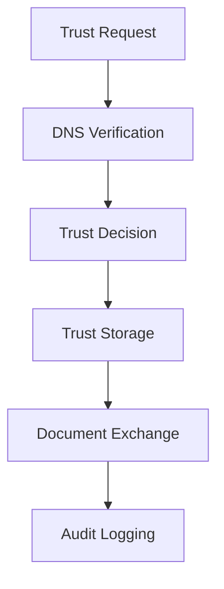

# BTPS: Billing Trust Protocol Secure

**BTPS (Billing Trust Protocol Secure)** is an open, trust-based protocol for secure, cryptographically verifiable billing and invoice communication. It is designed to stop invoice fraud, automate onboarding, and enable secure, auditable, and interoperable billing workflows across SaaS, fintech, and enterprise platforms.

## 🏗️ High-Level Architecture

BTPS is designed as a federated, open protocol. Here's a visual overview:



Or, as ASCII:

```
┌────────────┐      DNS TXT + .well-known       ┌─────────────┐
│            │  ─────────────────────────────▶  │             │
│            │     (Sign + Trust Request)       │             │
│  Sender    │  ─────────────────────────────▶  │  Receiver   │ ────▶ Inbox
│            │     (Verify + Trust Accept)      │             │
└────────────┘ ◀─────────────────────────────── └─────────────┘
       │                                               ▲
       ▼                                               │
    [Sign + Encrypt]                                   │
       │                                               │
       └───────────────────────────────────────────────┘ 
```

## What is BTPS?

BTPS is a next-generation protocol for exchanging billing and financial documents securely between organizations. It combines the best of email-like addressing, DNS-based identity, and modern cryptography to ensure that only trusted, verified parties can send and receive sensitive billing information.

### Key Features

- **Email-like addressing:** Use familiar addresses like `billing$vendorcorp.com` to send and receive documents
- **Trust-based delivery:** Only approved senders can deliver bills/invoices to your platform—no more spam or fraud
- **Cryptographic security:** Every message is signed, encrypted, and verifiable end-to-end
- **Automated onboarding:** DNS and `.well-known` records make trust establishment and key rotation seamless
- **Open and extensible:** Integrate with any backend, database, or workflow using the open SDK

## Why BTPS?

> BTPS addresses the growing risks of invoice fraud, manual onboarding, and lack of interoperability by providing a secure, automated, and trust-based protocol for exchanging sensitive billing documents.

### The Problem

- **Invoice fraud is rampant:** Billions are lost to fake invoices and business email compromise every year
- **Manual onboarding is slow:** Current systems require manual verification and trust establishment
- **Lack of interoperability:** Different billing systems don't work together securely
- **Poor audit trails:** Limited visibility into document flow and trust relationships
- **Security concerns:** Sensitive financial data transmitted without proper verification
- **Flexible for all sizes:** From startups to global enterprises, BTPS scales from file-based trust stores to full database and cloud integrations.

### The Solution

BTPS provides:

- **Trust-based security:** Only cryptographically verified, trusted senders can deliver documents
- **Automated onboarding:** DNS-based identity and protocol handshakes reduce friction
- **Federated interoperability:** Any SaaS, bank, or enterprise can join and interoperate
- **Complete audit trails:** Every message and trust change is logged and verifiable
- **Scalable architecture:** Works for startups to global enterprises

## How BTPS Works

> BTPS operates through a series of cryptographically secure steps: identity discovery, trust establishment, message signing and encryption, and robust key management, ensuring only trusted parties can exchange documents.

### 1. Identity & Discovery

Every participant publishes:

- **DNS TXT records** with their public key and protocol support
- **`.well-known` trust files** for trust relationship management
- **Inbox endpoints** for receiving messages

### 2. Trust Establishment

1. **Trust Request:** Sender requests trust from receiver
2. **Identity Verification:** Receiver verifies sender's DNS records and public key
3. **Trust Decision:** Receiver approves, rejects, or blocks the sender
4. **Trust Storage:** Trust relationship is stored in receiver's trust store

### 3. Secure Message Exchange

- **Signed messages:** Every message is cryptographically signed
- **Encrypted content:** Sensitive data is encrypted end-to-end
- **Trust verification:** Messages are only accepted from trusted senders
- **Audit logging:** All operations are logged for compliance

### 4. Key Management

- **Key rotation:** Senders can rotate keys via DNS updates
- **Trust continuity:** Trust relationships survive key changes
- **Revocation:** Trust can be revoked at any time
- **Expiration:** Trust relationships can have expiration dates

## Protocol Flow

> The BTPS protocol flow links trust requests, verification, decisions, and document exchanges into a seamless, auditable process for secure business communication.



## Architecture Components

> The BTPS protocol is built from several modular components, each responsible for a critical aspect of secure, trust-based document exchange. This section provides an overview of the core protocol, identity system, trust management, and supporting SDKs and tools that make BTPS robust and extensible.

### Core Protocol

> Defines the rules, message formats, and cryptographic operations that ensure all BTPS communications are secure, verifiable, and interoperable.

- **Message formats and artifacts structure:** Defines the standard structure for all BTPS artifacts, including documents, encryption, and signature fields. Ensures interoperability and consistent validation across all implementations.
- **Trust establishment and verification flows:** Outlines the handshake and approval process for establishing trust between parties, including request, verification, approval/rejection, and storage of trust records. Guarantees that only approved senders can deliver documents.
- **Cryptographic operations (signing, encryption, verification):** Utilizes strong cryptographic algorithms (e.g., AES-256-CBC, RSA, SHA-256) for signing, encrypting, and verifying messages. Ensures confidentiality, integrity, and authenticity of all communications.
- **Error handling and response codes:** Standardizes error responses and codes for all protocol operations, making it easier to debug, monitor, and automate error recovery.

### Identity System

> Provides decentralized, DNS-based identity management and public key distribution, enabling secure onboarding and ongoing verification of all participants.

- **DNS-based identity resolution:** Uses DNS TXT records and `.well-known` endpoints to publish and discover public keys and inbox endpoints. Enables decentralized, federated identity management without a central authority.
- **Public key distribution via DNS TXT records:** Ensures that public keys are easily discoverable and verifiable by any party, supporting secure onboarding and key rotation.
- **Key rotation and management:** Allows organizations to rotate cryptographic keys regularly for forward secrecy and to respond to key compromise. Key history is maintained for audit and compliance.
- **Identity verification procedures:** Provides mechanisms for verifying the authenticity of sender and receiver identities using cryptographic proofs and DNS-based validation.

### Trust Management

> Manages the lifecycle of trust relationships, from onboarding to revocation, and enforces trust-based access control for all document exchanges.

- **Trust stores (file-based, database, cloud):** Supports multiple storage backends for trust records, from simple JSON files for small deployments to scalable databases or cloud storage for enterprises.
- **Trust lifecycle (request, accept, reject, revoke, block, expire):** Manages the full lifecycle of trust relationships, including onboarding, active use, revocation, and expiration. Ensures that trust is always explicit and up-to-date.
- **Trust verification for message processing:** Every incoming message is checked against the trust store to ensure it comes from an approved sender. Untrusted or expired relationships are automatically rejected.
- **Trust audit and compliance:** All trust changes (creation, update, revocation) are logged for auditability and regulatory compliance. Supports reporting and monitoring for security teams.

### SDK & Tools

> Provides libraries, command-line tools, and extensibility hooks to make it easy for developers and operators to integrate, automate, and extend BTPS in any environment.

- **Client SDK for sending messages:** Provides easy-to-use libraries for integrating BTPS message sending into any application or workflow. Handles signing, encryption, and artifact creation automatically.
- **Server SDK for receiving and processing:** Simplifies the implementation of BTPS-compliant inboxes and trust management on the server side. Includes utilities for decryption, signature verification, and trust checks.
- **CLI tools for key management and testing:** Command-line utilities for generating keys, rotating keys, managing trust records, and testing protocol flows. Useful for both development and operations teams.
- **Middleware system for extensibility:** Allows organizations to add custom logic (e.g., compliance checks, analytics, custom notifications) to the BTPS workflow without modifying core protocol logic.

## Use Cases

> BTPS is designed to solve real-world problems for SaaS platforms, fintech companies, and large enterprises. The following use cases illustrate how BTPS can be applied to secure, automate, and audit billing and document workflows across industries.

### SaaS Platforms

> SaaS providers can use BTPS to deliver invoices securely, onboard vendors with trust-based workflows, and meet compliance requirements with full audit trails.

- **Secure invoice delivery to customers:** BTPS ensures that invoices are only delivered to trusted, verified recipients, reducing the risk of invoice fraud and misdelivery.
- **Trust-based onboarding of new vendors:** Automates the process of establishing trust with new vendors, reducing manual verification and speeding up onboarding.
- **Compliance and audit requirements:** Provides a complete audit trail of all billing communications and trust decisions, supporting regulatory compliance (e.g., SOX, PCI DSS).
- **Integration with existing billing systems:** BTPS SDKs and APIs make it easy to add secure, trust-based delivery to any existing SaaS billing or invoicing platform.

### Fintech Companies

> Financial technology firms benefit from BTPS by enabling secure, compliant document exchange, reducing fraud, and maintaining tamper-evident audit trails for all transactions.

- **Secure financial document exchange:** Enables the secure, verifiable exchange of sensitive financial documents (e.g., statements, payment requests) between institutions and clients.
- **Regulatory compliance and reporting:** Ensures that all document exchanges are logged, auditable, and compliant with financial regulations (e.g., GDPR, PSD2).
- **Fraud prevention and detection:** Only trusted, cryptographically verified senders can deliver documents, reducing the risk of phishing and business email compromise.
- **Audit trail maintenance:** Every message and trust change is logged, providing a tamper-evident record for audits and investigations.

### Enterprise Organizations

> Enterprises can use BTPS to automate vendor management, secure billing workflows, and ensure compliance with industry regulations through secure, auditable document exchange.

- **Vendor management and onboarding:** Streamlines the process of onboarding and managing vendors, with automated trust establishment and ongoing verification.
- **Secure billing workflows:** Ensures that all billing documents are delivered securely and only to trusted parties, reducing the risk of fraud and data leaks.
- **Compliance with industry regulations:** Supports compliance with industry-specific regulations (e.g., HIPAA, SOX, ISO 27001) by providing secure, auditable document exchange.
- **Integration with ERP and accounting systems:** BTPS can be integrated with enterprise resource planning (ERP) and accounting platforms to automate secure billing and payment workflows.

### Next Steps

- **Getting Started** to implement Btps protocol
- **Read the protocol specification** to understand the core concepts
- **Set up DNS records** for your domain identity
- **Implement a BTPS server** for receiving messages
- **Create a BTPS client** for sending messages
- **Establish trust relationships** with partners
- **Start exchanging** secure billing documents

## Documentation Structure


## License

BTPS is licensed under Apache 2.0 © Bhupendra Tamang

---

**Ready to dive deeper?** Check out the [protocol overview](protocol/overview) or jump straight to [SDK overview](sdk/overview).
