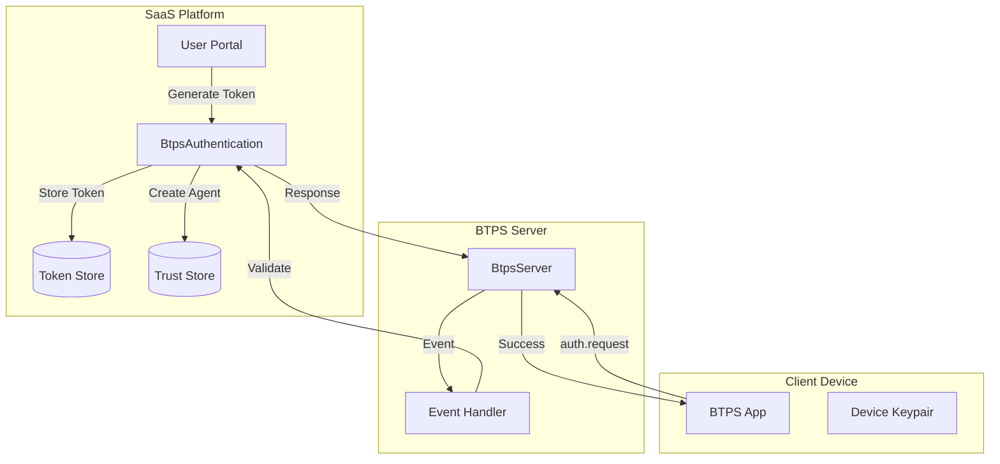
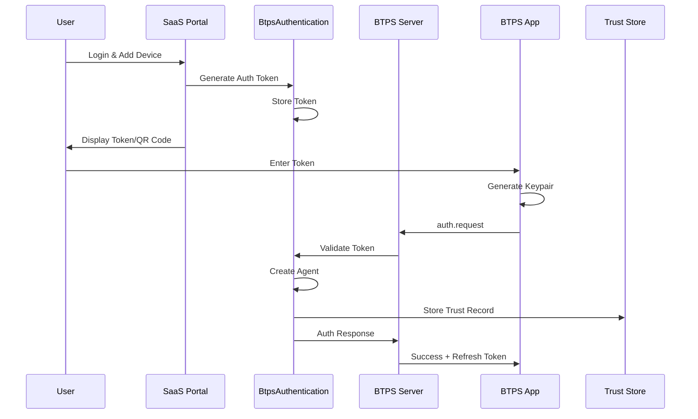
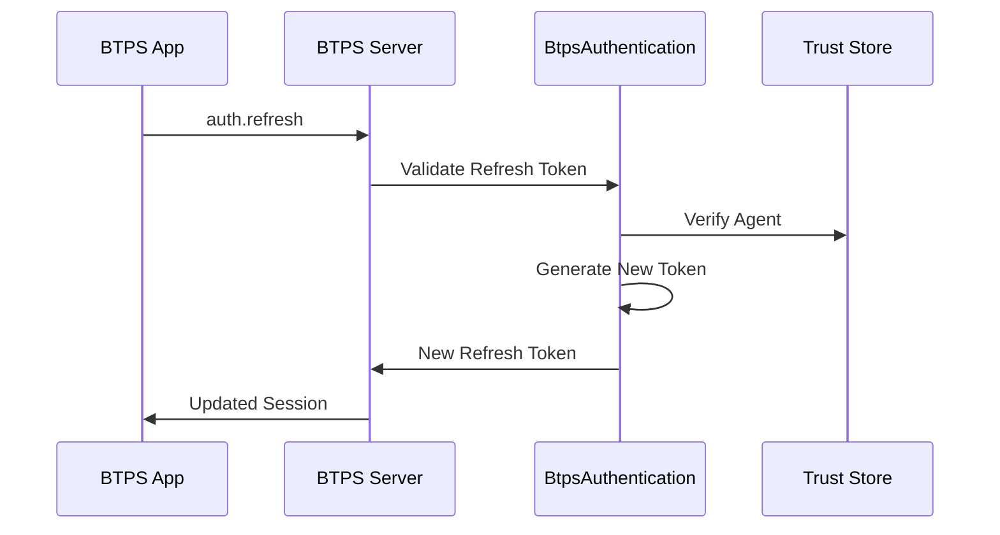

# BTPS Authentication Overview

BTPS Authentication provides a secure, token-based system for device registration and session management. It enables devices to authenticate with BTPS servers and obtain delegated access without sharing primary private keys, while maintaining cryptographic security and standardization.

## 🎯 Purpose

The authentication system addresses critical security and usability needs:

- **Device Registration**: Enable secure device onboarding without key sharing
- **Session Management**: Provide long-term access through refresh tokens
- **Multi-Device Support**: Allow users to access BTPS from multiple devices
- **Security**: Maintain cryptographic integrity while enabling delegation
- **Standardization**: Universal authentication flows across all BTPS implementations

## 🧩 Key Goals

- **Secure Device Onboarding**: Safe device registration with temporary tokens
- **Long-term Sessions**: Persistent access through refresh token rotation
- **Key Isolation**: Each device maintains its own cryptographic keys
- **Platform Independence**: Works with any BTPS server implementation
- **Audit Compliance**: Complete authentication and session tracking

## 🏗️ Architecture Overview

## 🔄 Authentication Flow

### **1. Device Registration Flow**

### **2. Session Refresh Flow**

## 📦 Core Components

### **1. BtpsAuthentication Class**

The central authentication class providing both server-side and client-side functionality:

**Server-side Features:**
- Token generation and validation
- Agent creation and trust record management
- Refresh token issuance and rotation
- Session cleanup and expiration handling

**Client-side Features:**
- Static authentication methods
- Session refresh functionality
- Encrypted response handling
- Identity validation

### **2. Token Management**

| Token Type | Purpose | Issuer | Expiry | Usage |
|------------|---------|--------|--------|-------|
| **Auth Token** | Device registration | SaaS Portal | 5-15 minutes | Initial device setup |
| **Refresh Token** | Session management | BTPS Server | 7-90 days | Long-term access |

### **3. Storage Backends**

**Built-in Implementations:**
- `InMemoryTokenStore`: Development and testing
- `InMemoryAuthSessionStore`: Session management

**Custom Implementations:**
- Redis, Database, or any custom storage
- Implement `TokenStore` and `AuthSessionStore` interfaces

### **4. Trust Integration**

- **Trust Records**: Store agent information and permissions
- **Agent Management**: Track device registrations and status
- **Session Tracking**: Monitor active sessions and expiration

## 🔐 Security Model

### **Token Security**
- **Short-lived Auth Tokens**: 5-15 minute expiry for device registration
- **Secure Refresh Tokens**: Long-lived with secure rotation
- **Cryptographic Validation**: All tokens cryptographically signed
- **Scope Limitation**: Tokens limited to specific permissions

### **Key Management**
- **Device Isolation**: Each device generates its own keypair
- **No Key Sharing**: Primary keys never leave original device
- **Secure Storage**: Platform-specific secure key storage
- **Key Rotation**: Support for periodic key updates

### **Session Security**
- **Automatic Cleanup**: Expired sessions automatically removed
- **Revocation Support**: Immediate session termination
- **Audit Logging**: Complete authentication and session tracking
- **Encryption**: All sensitive data encrypted in transit and at rest

## 🎯 Use Cases

### **Mobile Applications**
- Secure device registration via QR codes or manual entry
- Persistent sessions with automatic refresh
- Offline capability with cached credentials

### **Multi-Device Access**
- Desktop, tablet, and phone access to same BTPS identity
- Independent device management and revocation
- Granular permission control per device

### **Enterprise Integration**
- Standardized authentication across all BTPS implementations
- Integration with existing identity management systems
- Compliance with enterprise security policies

### **Third-Party Applications**
- Universal BTPS client libraries
- Platform-agnostic authentication flows
- Consistent protocol behavior

## ✅ Benefits

- **Security**: Cryptographic separation prevents key compromise
- **Usability**: Simple device registration with temporary tokens
- **Scalability**: Token-based system scales with user growth
- **Standardization**: Universal authentication across platforms
- **Compliance**: Complete audit trail and session management
- **Flexibility**: Pluggable storage backends for any deployment

## 🔮 Future Extensions

- **WebAuthn Integration**: Hardware-bound device authentication
- **OAuth Integration**: Third-party identity provider support
- **Advanced Scopes**: Granular permission management
- **Push Notifications**: Real-time session updates
- **Analytics**: Authentication and session analytics
- **Multi-Factor Authentication**: Enhanced security options
