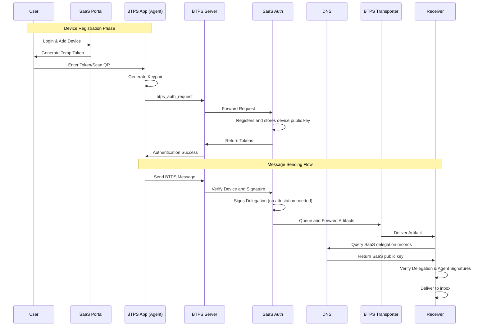
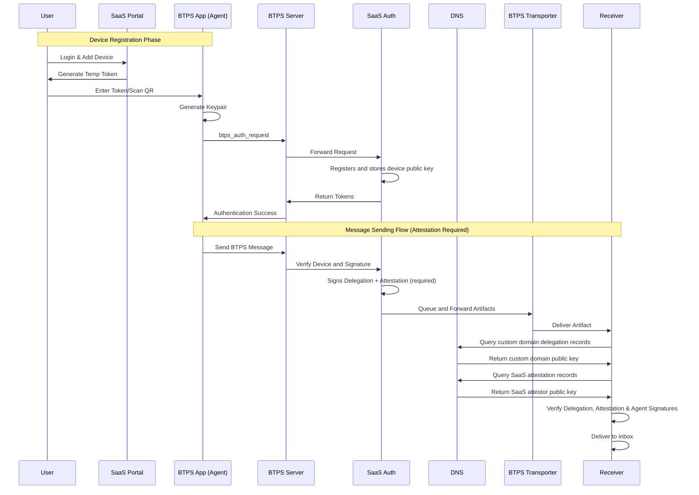
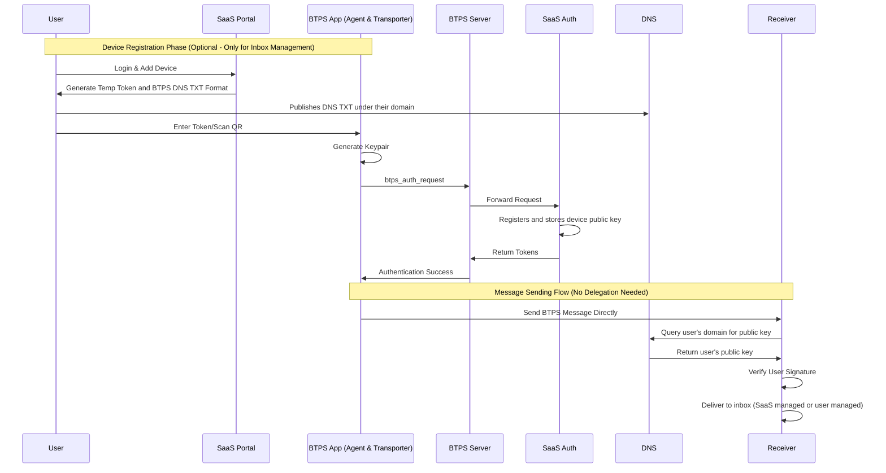

# BTPS Delegation Message Flow

The delegation message flow describes how different types of users send BTPS messages through delegation and how receiving BTPS servers verify delegation before delivering messages to recipients. The flow varies based on the user type and their key management approach.

## 🎯 User Types Overview

BTPS supports three main user types with different delegation flows:

1. **SaaS Managed Users**: Users under SaaS domain with full SaaS management
2. **Custom Domain Users**: Users with custom domains but managed by SaaS
3. **E2E Users**: Users who bring their own keys (BYOK) with optional SaaS inbox management

## 🔄 SaaS Managed Users Flow

Users under SaaS domain (e.g., `alice$saas.com`) with full SaaS management of keys and delegation.



### **Key Characteristics**

- **Domain**: Uses SaaS domain (e.g., `alice$saas.com`)
- **Key Management**: SaaS manages all keys and delegation records
- **Attestation**: Not required (delegator ≠ artifact sender)
- **DNS Records**: SaaS publishes delegation records in DNS
- **Revocation**: Through SaaS portal (immediate removal from DNS)

## 🔄 Custom Domain Users Flow

Users with custom domains (e.g., `alice$enterprise.com`) but managed by SaaS, requiring attestation.



### **Key Characteristics**

- **Domain**: Uses custom domain (e.g., `alice$enterprise.com`)
- **Key Management**: SaaS manages keys but publishes under custom domain
- **Attestation**: Required (delegator = artifact sender)
- **DNS Records**: Custom domain publishes delegation, SaaS publishes attestation
- **Revocation**: Through SaaS portal (immediate removal from DNS)

## 🔄 E2E Users Flow (BYOK)

Users who bring their own keys and manage their own domains, with optional SaaS inbox management.



### **Key Characteristics**

- **Domain**: Uses their own domain (e.g., `alice$mye2e.com`)
- **Key Management**: User manages all keys and DNS records
- **Delegation**: Not needed (user signs directly with their key)
- **DNS Records**: User publishes their own public key in DNS
- **Inbox Management**: Optional SaaS management or user self-hosted
- **Revocation**: User manages their own DNS records

## 📤 Message Sending Process by User Type

### **SaaS Managed Users**

1. **Agent Message Creation**: Agent creates and signs BTPS artifact
2. **SaaS Verification**: SaaS verifies agent signature and trust
3. **Delegation Addition**: SaaS adds delegation signature (no attestation)
4. **Transporter Delivery**: Message sent through BTPS transporter
5. **Receiver Verification**: Receiver verifies delegation and agent signatures

### **Custom Domain Users**

1. **Agent Message Creation**: Agent creates and signs BTPS artifact
2. **SaaS Verification**: SaaS verifies agent signature and trust
3. **Delegation + Attestation**: SaaS adds both delegation and attestation signatures
4. **Transporter Delivery**: Message sent through BTPS transporter
5. **Receiver Verification**: Receiver verifies delegation, attestation, and agent signatures

### **E2E Users**

1. **Direct Message Creation**: User creates and signs BTPS artifact directly
2. **Direct Delivery**: Message sent directly to receiver (no SaaS involvement)
3. **Receiver Verification**: Receiver verifies user signature directly
4. **Inbox Delivery**: Message delivered to SaaS-managed or self-hosted inbox

## 📥 Receiving & Verification Process

### **Delegation Verification (SaaS & Custom Domain Users)**

The receiver performs comprehensive verification:

#### **Step 1: Attestation Requirement Check**
- **SaaS Users**: No attestation required (`delegation.signedBy !== artifact.from`)
- **Custom Domain Users**: Attestation required (`delegation.signedBy === artifact.from`)

#### **Step 2: Attestation Verification (Custom Domain Only)**
- Resolve SaaS attestor's public key via DNS
- Verify attestation signature against delegation metadata
- Reject if verification fails

#### **Step 3: Delegation Signature Verification**
- Resolve delegator's public key via DNS
- Verify delegation signature using delegator's public key
- Reject if verification fails

#### **Step 4: Agent Signature Verification**
- Extract original artifact (without delegation)
- Verify agent signature using `delegation.agentPubKey`
- Reject if verification fails

### **Direct Verification (E2E Users)**

The receiver performs direct verification:

#### **Step 1: Public Key Resolution**
- Resolve user's public key via DNS from their domain
- Verify user signature directly
- Reject if verification fails

## 🔐 DNS Resolution by User Type

### **SaaS Managed Users**
```bash
# Resolve SaaS delegation records
dig TXT alice.btps.saas.com
# Returns: SaaS public key for delegation verification
```

### **Custom Domain Users**
```bash
# Resolve custom domain delegation records
dig TXT alice.btps.enterprise.com
# Returns: Custom domain public key for delegation verification

# Resolve SaaS attestation records
dig TXT admin.btps.saas.com
# Returns: SaaS public key for attestation verification
```

### **E2E Users**
```bash
# Resolve user's own domain records
dig TXT alice.btps.mye2e.com
# Returns: User's public key for direct verification
```

## 🚨 Error Handling by User Type

### **SaaS Managed Users**
| Error | Cause | Action |
|-------|-------|--------|
| `DELEGATION_INVALID` | Invalid delegation structure | Reject message |
| `DELEGATION_SIG_VERIFICATION_FAILED` | Invalid delegation signature | Reject message |
| `RESOLVE_PUBKEY` | SaaS DNS resolution failed | Retry with fallback DNS |

### **Custom Domain Users**
| Error | Cause | Action |
|-------|-------|--------|
| `DELEGATION_INVALID` | Missing attestation | Reject message |
| `ATTESTATION_VERIFICATION_FAILED` | Invalid attestation signature | Reject message |
| `DELEGATION_SIG_VERIFICATION_FAILED` | Invalid delegation signature | Reject message |
| `RESOLVE_PUBKEY` | DNS resolution failed | Retry with fallback DNS |

### **E2E Users**
| Error | Cause | Action |
|-------|-------|--------|
| `RESOLVE_PUBKEY` | User DNS resolution failed | Retry with fallback DNS |
| `SIGNATURE_VERIFICATION_FAILED` | Invalid user signature | Reject message |

## 📊 Performance Considerations

### **DNS Resolution**
- **TTL Settings**: Use appropriate TTL for each user type
- **Caching**: Implement DNS caching with user-type-aware invalidation
- **Fallback**: Handle DNS resolution failures gracefully

### **Signature Verification**
- **Parallel Processing**: Verify multiple signatures concurrently where possible
- **Key Caching**: Cache verified public keys to reduce DNS lookups
- **Timeout Handling**: Implement timeouts for slow cryptographic operations

## 🔄 Implementation Guidelines

### **For SaaS Platforms**

1. **User Type Detection**: Determine user type during registration
2. **Key Management**: Handle different key management approaches
3. **Attestation Logic**: Implement attestation for custom domain users
4. **DNS Management**: Publish appropriate DNS records for each user type

### **For BTPS Clients**

1. **Flow Detection**: Detect appropriate flow based on user type
2. **Signature Generation**: Sign messages according to user type
3. **Error Handling**: Handle different error scenarios appropriately
4. **Security**: Maintain cryptographic security throughout

### **For BTPS Servers**

1. **User Type Routing**: Route messages to appropriate verification flow
2. **Verification Pipeline**: Apply correct verification process for each user type
3. **Error Reporting**: Provide clear error messages for each user type
4. **Monitoring**: Monitor performance and errors by user type 