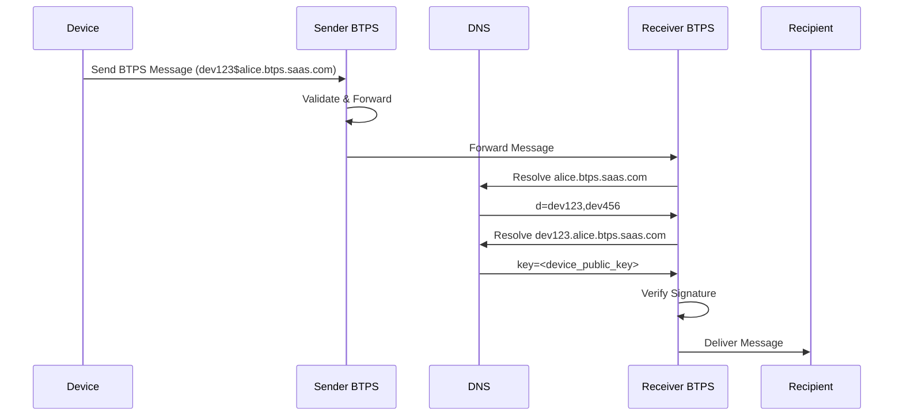
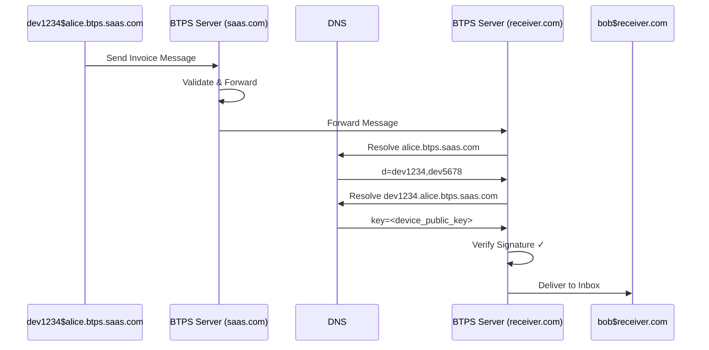
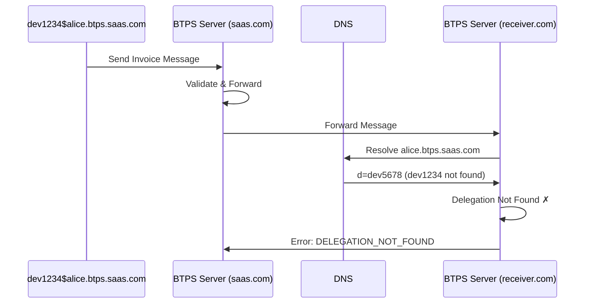

# BTPS Delegation Message Flow

The delegation message flow describes how delegated devices send BTPS messages and how receiving BTPS servers verify delegation before delivering messages to recipients.

## 🔄 Message Flow Overview



## 📤 Sending Messages with Delegation

### **Device Message Preparation**

When a delegated device sends a BTPS message, it uses its delegated identity and signs with its own private key.

**Delegated Identity Format**:
```
{delegated_id}${original_identity}
```

**Example**:
```
dev1234$alice.btps.saas.com
```

### **Message Construction**

```json
{
  "version": "1.0",
  "issuedAt": "2025-01-15T10:30:00Z",
  "document": {
    "title": "Monthly Service Invoice",
    "id": "INV-2025-001",
    "totalAmount": {
      "value": 1500.00,
      "currency": "USD"
    }
  },
  "id": "msg_abc123",
  "type": "btp_invoice",
  "from": "dev1234$alice.btps.saas.com",
  "to": "bob$receiver.com",
  "signature": {
    "algorithm": "sha256",
    "value": "base64_encoded_signature",
    "fingerprint": "device_public_key_fingerprint"
  },
  "encryption": {
    "algorithm": "aes-256-cbc",
    "encryptedKey": "base64_encrypted_aes_key",
    "iv": "base64_iv",
    "type": "standardEncrypt"
  }
}
```

### **Signature Generation**

The device signs the message using its own private key:

```javascript
// Device signs the message
const messageHash = sha256(JSON.stringify({
  version: "1.0",
  issuedAt: "2025-01-15T10:30:00Z",
  document: invoiceDocument,
  id: "msg_abc123",
  type: "btp_invoice",
  from: "dev1234$alice.btps.saas.com",
  to: "bob$receiver.com"
}));

const signature = signWithPrivateKey(messageHash, devicePrivateKey);
```

## 📥 Receiving & Verification Flow

### **1. Message Reception**

The receiver's BTPS server receives the message and extracts the sender identity.

**Extracted Identity**: `dev1234$alice.btps.saas.com`

### **2. Delegation Resolution**

The receiver performs DNS lookups to verify delegation:

```bash
# Step 1: Resolve original identity
dig TXT alice.btps.saas.com

# Expected response:
alice.btps.saas.com. 300 IN TXT "key=...primary_key...&d=dev1234,dev5678"

# Step 2: Resolve delegated identity
dig TXT dev1234.alice.btps.saas.com

# Expected response:
dev1234.alice.btps.saas.com. 300 IN TXT "key=-----BEGIN PUBLIC KEY-----\n...device_public_key...\n-----END PUBLIC KEY-----"
```

### **3. Delegation Verification**

The receiver verifies the delegation chain:

1. **Parent Identity Check**: Verify `alice.btps.saas.com` exists and contains `dev1234` in delegation list
2. **Device Key Resolution**: Resolve `dev1234.alice.btps.saas.com` to get device public key
3. **Signature Verification**: Verify message signature using device public key
4. **Scope Validation**: Check if device has required permissions (if applicable)

### **4. Message Delivery**

If all verifications pass, the message is delivered to the recipient's inbox.

## 🔍 DNS Record Structure

### **Parent Identity Record**

```bash
alice.btps.saas.com IN TXT "key=-----BEGIN PUBLIC KEY-----\n...primary_public_key...\n-----END PUBLIC KEY-----&d=dev1234,dev5678,dev9012"
```

**Components**:
- `key=`: Primary identity public key
- `d=`: Comma-separated list of delegated device IDs

### **Device Delegation Record**

```bash
dev1234.alice.btps.saas.com IN TXT "key=-----BEGIN PUBLIC KEY-----\n...device_public_key...\n-----END PUBLIC KEY-----"
```

**Components**:
- `key=`: Device-specific public key for signature verification

## 🛡️ Security Verification Steps

### **1. Identity Chain Verification**

```javascript
async function verifyDelegation(delegatedIdentity) {
  const [delegatedId, originalIdentity] = delegatedIdentity.split('$');
  
  // Step 1: Verify original identity exists
  const parentRecord = await resolveDNS(originalIdentity);
  if (!parentRecord) {
    throw new Error('Original identity not found');
  }
  
  // Step 2: Check if device is in delegation list
  const delegations = extractDelegations(parentRecord);
  if (!delegations.includes(delegatedId)) {
    throw new Error('Device not authorized for delegation');
  }
  
  // Step 3: Resolve device public key
  const deviceRecord = await resolveDNS(`${delegatedId}.${originalIdentity}`);
  if (!deviceRecord) {
    throw new Error('Device delegation record not found');
  }
  
  return extractPublicKey(deviceRecord);
}
```

### **2. Signature Verification**

```javascript
async function verifyDelegatedSignature(message, delegatedIdentity) {
  const devicePublicKey = await verifyDelegation(delegatedIdentity);
  
  // Verify message signature using device public key
  const messageHash = sha256(JSON.stringify({
    version: message.version,
    issuedAt: message.issuedAt,
    document: message.document,
    id: message.id,
    type: message.type,
    from: message.from,
    to: message.to
  }));
  
  return verifySignature(messageHash, message.signature.value, devicePublicKey);
}
```

## ⚠️ Error Scenarios

### **Delegation Verification Failures**

| Error | Cause | Action |
|-------|-------|--------|
| `DELEGATION_NOT_FOUND` | Device ID not in parent record | Reject message |
| `DEVICE_KEY_NOT_FOUND` | Device DNS record missing | Reject message |
| `SIGNATURE_VERIFICATION_FAILED` | Invalid device signature | Reject message |
| `DELEGATION_EXPIRED` | Delegation has expired | Reject message |

### **Recovery Actions**

1. **Message Rejection**: Log error and return appropriate error response
2. **DNS Cache Refresh**: Clear DNS cache and retry resolution
3. **Fallback Verification**: Attempt to verify with primary identity key
4. **Error Reporting**: Notify sender of delegation issues

## 📊 Performance Considerations

### **DNS Caching**

- **TTL Settings**: Use appropriate TTL for delegation records (60-300 seconds)
- **Cache Management**: Implement DNS caching with delegation-aware invalidation
- **Fallback Resolution**: Handle DNS resolution failures gracefully

### **Verification Optimization**

- **Parallel Resolution**: Resolve parent and device records concurrently
- **Signature Verification**: Use efficient cryptographic libraries
- **Result Caching**: Cache verification results for recent delegations

## 🔄 Message Flow Examples

### **Successful Delegation Flow**



### **Failed Delegation Flow**



## 📱 Implementation Guidelines

### **Client-Side Implementation**

```javascript
class DelegatedBTPSClient {
  constructor(credentials) {
    this.delegatedIdentity = credentials.delegated_identity;
    this.privateKey = credentials.device_private_key;
    this.accessToken = credentials.access_token;
  }
  
  async sendMessage(to, document, type = 'btp_invoice') {
    const message = {
      version: "1.0",
      issuedAt: new Date().toISOString(),
      document,
      id: generateMessageId(),
      type,
      from: this.delegatedIdentity,
      to
    };
    
    // Sign with device private key
    const signature = await this.signMessage(message);
    message.signature = signature;
    
    // Encrypt if needed
    if (this.shouldEncrypt(document)) {
      message.encryption = await this.encryptDocument(document, to);
    }
    
    return await this.sendToBTPS(message);
  }
  
  async signMessage(message) {
    const messageHash = sha256(JSON.stringify({
      version: message.version,
      issuedAt: message.issuedAt,
      document: message.document,
      id: message.id,
      type: message.type,
      from: message.from,
      to: message.to
    }));
    
    const signatureValue = await signWithPrivateKey(messageHash, this.privateKey);
    const fingerprint = await getPublicKeyFingerprint(this.privateKey);
    
    return {
      algorithm: "sha256",
      value: signatureValue,
      fingerprint
    };
  }
}
```

### **Server-Side Verification**

```javascript
class DelegationVerifier {
  async verifyDelegatedMessage(message) {
    const delegatedIdentity = message.from;
    
    try {
      // Verify delegation chain
      const devicePublicKey = await this.verifyDelegation(delegatedIdentity);
      
      // Verify signature
      const isValid = await this.verifySignature(message, devicePublicKey);
      
      if (!isValid) {
        throw new Error('SIGNATURE_VERIFICATION_FAILED');
      }
      
      return true;
    } catch (error) {
      console.error('Delegation verification failed:', error);
      return false;
    }
  }
  
  async verifyDelegation(delegatedIdentity) {
    const [delegatedId, originalIdentity] = delegatedIdentity.split('$');
    
    // Resolve parent identity
    const parentRecord = await this.resolveDNS(originalIdentity);
    const delegations = this.extractDelegations(parentRecord);
    
    if (!delegations.includes(delegatedId)) {
      throw new Error('DELEGATION_NOT_FOUND');
    }
    
    // Resolve device key
    const deviceRecord = await this.resolveDNS(`${delegatedId}.${originalIdentity}`);
    return this.extractPublicKey(deviceRecord);
  }
}
```
