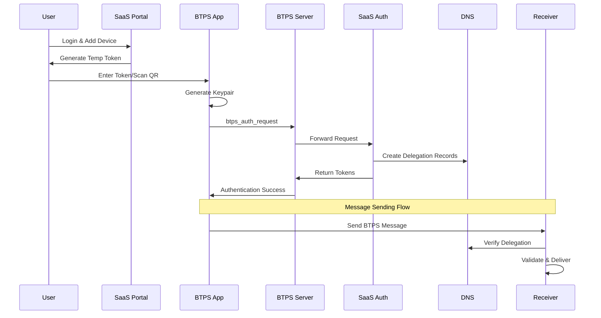

# BTPS Delegation & Authentication Overview

BTPS delegation enables users to send, view, and manage BTPS documents from multiple devices without sharing their primary private key. This architecture makes the BTPS protocol device and platform agnostic while maintaining security and standardization.

## 🎯 Purpose

The delegation system addresses a critical need: **users want to access BTPS functionality from any device** (phones, tablets, laptops) without compromising security by copying private keys across multiple devices. Additionally, it ensures that BTPS client applications follow standardized protocols regardless of the SaaS platform implementation.

## 🧩 Key Goals

- **Device Independence**: Enable BTPS functionality on any device without private key sharing
- **Platform Agnostic**: Standardize client apps so they work with any BTPS implementation
- **Security**: Maintain cryptographic security while enabling delegation
- **Revocation**: Provide real-time device revocation capabilities
- **Federation**: Keep BTPS servers simple and universal while delegating auth logic to SaaS platforms

## 🏗️ Architecture Principles

### 1. **DNS-Based Delegation**
- All delegation records are stored in DNS TXT records
- Enables real-time verification without SaaS server dependency
- Supports immediate revocation through DNS updates

### 2. **Cryptographic Separation**
- Each device generates its own public/private keypair
- Primary identity key never leaves the original device/SaaS
- Device keys are cryptographically bound to delegation records

### 3. **Standardized Protocol**
- All BTPS clients follow the same delegation flow
- No custom authentication per SaaS platform
- Universal BTPS server behavior

## 🔄 High-Level Flow

## 📦 Core Components

### 1. **Delegation Records**
- **Parent Record**: `user.btps.domain.com TXT "d=dev123,dev456"`
- **Device Record**: `dev123.user.btps.domain.com TXT "key=<device_pubkey>"`

### 2. **Authentication Artifacts**
- `btps_auth_request`: Initial device authentication
- `btps_refresh_request`: Token renewal
- `btps_delegation`: Delegation confirmation

### 3. **Token Types**
| Token Type | Purpose | Issuer | Expiry |
|------------|---------|--------|--------|
| Temporary Token | Bootstrap auth request | SaaS Portal | 5-10 minutes |
| Access Token | Authorize polling | BTPS Server | 15 minutes |
| Refresh Token | Rotate access token | BTPS Server | 30-90 days |

## 🔒 Security Model

### **Delegation Verification**
1. **DNS Resolution**: Verify delegated identity exists
2. **Key Validation**: Confirm device public key matches DNS record
3. **Signature Verification**: Validate message signature with device key
4. **Scope Checking**: Ensure device has required permissions

### **Revocation Mechanism**
- **Immediate**: Remove DNS TXT records
- **Propagation**: Controlled by DNS TTL (typically 60 seconds)
- **Verification**: All BTPS servers automatically reject revoked devices

## ✅ Benefits

- **No SaaS Dependency**: Messages sent directly without SaaS server uptime
- **Real-time Revocation**: DNS-based revocation with fast propagation
- **Standardized Clients**: Universal BTPS app behavior across platforms
- **Device Privacy**: Each device maintains its own private key
- **Scalable**: DNS-based delegation scales with identity sharding
- **Secure**: Cryptographic separation prevents key compromise

## 🎯 Use Cases

### **Mobile Applications**
- Send invoices from phone without copying private keys
- Access inbox and trust requests on mobile
- Real-time notifications and polling

### **Multi-Device Access**
- Desktop, tablet, and phone access to same BTPS identity
- Granular permission control per device
- Independent device revocation

### **Third-Party Integrations**
- Standardized BTPS client libraries
- Platform-agnostic authentication flows
- Consistent protocol behavior across implementations

## 🔮 Future Extensions

- **Multi-device revocation lists**
- **Push-based SaaS delegation**
- **Hardware-bound device keys**
- **WebAuthn/Passkey integration**
- **Advanced permission scopes**
- **Delegation analytics and monitoring**
