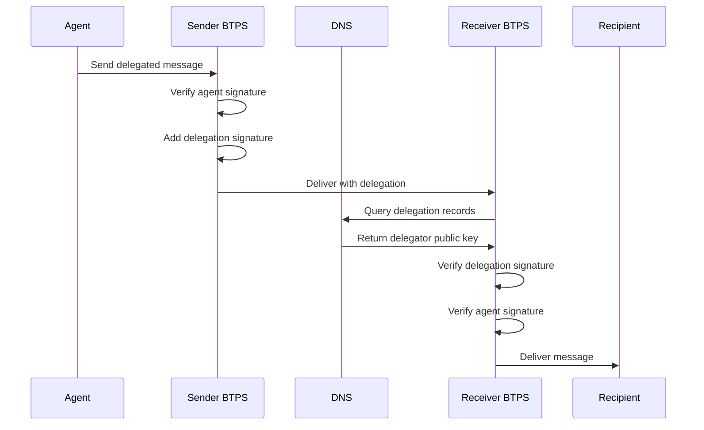

# BTPS Delegation Overview

BTPS delegation enables secure message sending on behalf of another identity through cryptographic authorization which enables users to send, view, and manage BTPS documents from multiple devices without sharing their primary private key. This system allows agents (devices/applications) to send messages while maintaining the security and authenticity of the original identity. This architecture makes the BTPS protocol device and platform agnostic while maintaining security and standardization.

## 🎯 Purpose

The delegation system addresses a critical need: **users want to access BTPS functionality from any device** (phones, tablets, laptops) without compromising security by copying private keys across multiple devices. Additionally, it ensures that BTPS client applications follow standardized protocols regardless of the SaaS platform implementation.
It addresses the need for **secure multi-device access** without compromising the primary identity's private key. It enables:

- **Device Independence**: Send messages from any authorized device
- **Platform Agnostic**: Standardize client apps so they work with any BTPS implementation
- **Federation**: Keep BTPS servers simple and universal while delegating auth logic to SaaS platforms
- **Cryptographic Security**: Maintain end-to-end security through delegation signatures
- **Real-time Verification**: DNS-based delegation verification without server dependency
- **Immediate Revocation**: Fast delegation removal through DNS updates providing real-time device revocation capabilities

## 🔄 Delegation Flow Overview



## 🏗️ Architecture Principles

### 1. **Cryptographic Delegation**

- Delegator signs delegation records with their private key
- Agent signs original messages with their own private key
- Receivers verify both signatures for complete authorization chain

### 2. **DNS-Based Verification**

- Delegation records published in DNS TXT records
- Real-time verification without SaaS server dependency
- Immediate revocation through DNS record removal

### 3. **Attestation Support**

- Optional third-party attestation for custom domain delegations
- Enhanced security for sensitive operations
- Audit trail for delegation approvals

## 📦 Core Components

### 1. **Delegation Structure**

```json
{
  "delegation": {
    "agentId": "device_agent_123",
    "agentPubKey": "-----BEGIN PUBLIC KEY-----\n...\n-----END PUBLIC KEY-----",
    "signedBy": "alice$saas.com",
    "issuedAt": "2025-01-15T10:30:00Z",
    "signature": {
      "algorithmHash": "sha256",
      "value": "base64-encoded-signature",
      "fingerprint": "sha256-base64-fingerprint"
    },
    "selector": "btps1",
    "attestation": {
      "issuedAt": "2025-01-15T10:30:00Z",
      "signedBy": "admin$saas.com",
      "signature": {
        "algorithmHash": "sha256",
        "value": "base64-encoded-signature",
        "fingerprint": "sha256-base64-fingerprint"
      },
      "selector": "btps1"
    }
  }
}
```

### 2. **Delegation Types**

#### **Standard Delegation (SaaS Managed)**

- Delegator and agent under same SaaS domain
- No attestation required
- Direct delegation signature verification

#### **Custom Domain Delegation**

- Delegator owns custom domain
- Attestation required from trusted authority
- Enhanced security through third-party validation

### 3. **Verification Process**

The BTPS server implements a comprehensive verification pipeline:

1. **Attestation Check**: Determine if attestation is required
2. **Attestation Verification**: Verify third-party signature (if present)
3. **Delegation Verification**: Verify delegator's signature
4. **Agent Verification**: Verify agent's signature on original message

## 🔒 Security Model

### **Multi-Layer Verification**

1. **DNS Resolution**: Verify delegator identity exists
2. **Key Validation**: Confirm delegator public key matches DNS record
3. **Signature Verification**: Validate delegation and agent signatures
4. **Attestation Validation**: Verify third-party approval (when required)

### **Revocation Mechanism**

- **Immediate**: Remove DNS TXT records
- **Propagation**: Controlled by DNS TTL (typically 60-300 seconds)
- **Verification**: All BTPS servers automatically reject revoked delegations

## ✅ Benefits

- **No SaaS Dependency**: Messages verifiable without SaaS server uptime
- **Real-time Revocation**: DNS-based revocation with fast propagation
- **Cryptographic Security**: End-to-end signature verification
- **Attestation Support**: Third-party validation for enhanced security
- **Scalable**: DNS-based delegation scales with identity management

## 🎯 Use Cases

### **Multi-Device Access**

- Send messages from mobile, desktop, or tablet
- Maintain security without key sharing
- Independent device revocation

### **Third-Party Integrations**

- Standardized delegation protocols
- Platform-agnostic verification
- Consistent security model

### **Enterprise Security**

- Granular delegation control
- Audit trail for all delegations
- Compliance with security policies

## 🔮 Future Extensions

- **Multi-level delegation chains**
- **Time-limited delegations**
- **Scope-based permissions**
- **Hardware-bound delegation keys**
- **Delegation analytics and monitoring**
