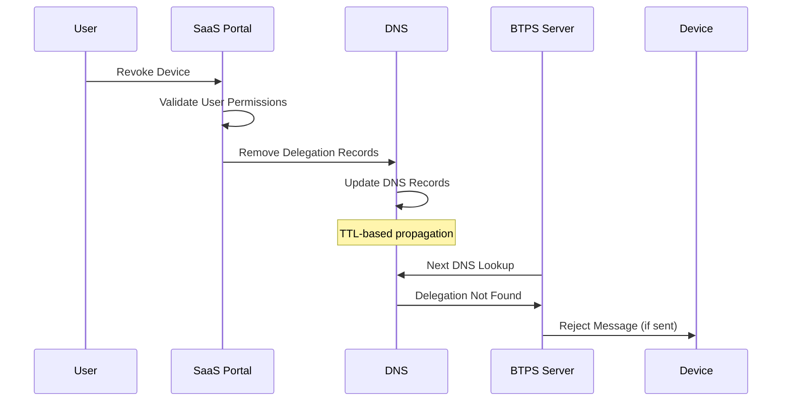

# BTPS Delegation Revocation

BTPS delegation revocation provides real-time control over device access by removing delegation records from DNS. This ensures immediate security when devices are lost, compromised, or no longer needed.

## 🎯 Purpose

Delegation revocation addresses critical security needs:
- **Device Loss**: Immediately revoke access when devices are lost or stolen
- **Security Breach**: Remove compromised device access
- **Access Control**: Manage device permissions and access lifecycle
- **Compliance**: Meet regulatory requirements for access termination

## 🔄 Revocation Flow Overview



## 📋 Revocation Process

### **1. User Initiates Revocation**

**Location**: SaaS Portal (e.g., `https://portal.saas.com`)

**Actions**:
- User logs into SaaS account
- Navigates to "Device Management"
- Selects device to revoke
- Confirms revocation action

**Security Checks**:
- Verify user has authority to revoke device
- Confirm device ownership
- Log revocation action for audit trail

### **2. DNS Record Removal**

**Location**: SaaS DNS Management System

**Actions**:
1. **Remove Device Record**: Delete `dev1234.alice.btps.saas.com` TXT record
2. **Update Parent Record**: Remove `dev1234` from `d=` field in `alice.btps.saas.com`

**Before Revocation**:
```bash
# Device delegation record
dev1234.alice.btps.saas.com IN TXT "key=-----BEGIN PUBLIC KEY-----\n...device_public_key...\n-----END PUBLIC KEY-----"

# Parent identity record
alice.btps.saas.com IN TXT "key=...primary_key...&d=dev1234,dev5678"
```

**After Revocation**:
```bash
# Device record removed
# dev1234.alice.btps.saas.com IN TXT "key=..."  # DELETED

# Updated parent record
alice.btps.saas.com IN TXT "key=...primary_key...&d=dev5678"
```

### **3. DNS Propagation**

**Timeline**:
- **Immediate**: DNS records updated at authoritative server
- **TTL-based**: Propagation depends on DNS TTL settings (typically 60-300 seconds)
- **Global**: All BTPS servers will see updated records within TTL period

**TTL Considerations**:
```bash
# Recommended TTL settings for delegation records
dev1234.alice.btps.saas.com IN TXT "key=..." 300  # 5 minutes
alice.btps.saas.com IN TXT "key=...&d=..." 300    # 5 minutes
```

## 🛡️ Security Implications

### **Immediate Effects**

1. **Message Rejection**: Any messages sent by revoked device will be rejected
2. **Access Termination**: Device can no longer send BTPS messages
3. **Token Invalidation**: Access and refresh tokens become invalid
4. **DNS Verification**: All BTPS servers will reject revoked device signatures

### **Verification Process**

When a BTPS server receives a message from a revoked device:

```javascript
async function verifyDelegation(delegatedIdentity) {
  const [delegatedId, originalIdentity] = delegatedIdentity.split('$');
  
  // Step 1: Check if device is still in delegation list
  const parentRecord = await resolveDNS(originalIdentity);
  const delegations = extractDelegations(parentRecord);
  
  if (!delegations.includes(delegatedId)) {
    throw new Error('DELEGATION_REVOKED');
  }
  
  // Step 2: Verify device record still exists
  const deviceRecord = await resolveDNS(`${delegatedId}.${originalIdentity}`);
  if (!deviceRecord) {
    throw new Error('DEVICE_RECORD_NOT_FOUND');
  }
  
  return extractPublicKey(deviceRecord);
}
```

## ⚠️ Error Scenarios

### **Revocation-Related Errors**

| Error Code | Description | Cause | Resolution |
|------------|-------------|-------|------------|
| `DELEGATION_REVOKED` | Device has been revoked | Device removed from delegation list | Re-authenticate device |
| `DEVICE_RECORD_NOT_FOUND` | Device DNS record missing | Device record deleted | Contact SaaS provider |
| `SIGNATURE_VERIFICATION_FAILED` | Invalid signature after revocation | Device key no longer valid | Re-authenticate device |

### **Recovery Actions**

1. **Device Re-authentication**: User must re-add device through SaaS portal
2. **New Key Generation**: Device generates new public/private keypair
3. **DNS Record Recreation**: SaaS creates new delegation records
4. **Token Refresh**: Device obtains new access and refresh tokens

## 🔍 Revocation Detection

### **Client-Side Detection**

```javascript
class DelegatedBTPSClient {
  async sendMessage(to, document, type = 'btp_invoice') {
    try {
      const response = await this.sendToBTPS(message);
      return response;
    } catch (error) {
      if (error.code === 'DELEGATION_REVOKED') {
        await this.handleRevocation();
      }
      throw error;
    }
  }
  
  async handleRevocation() {
    // Clear stored credentials
    await this.clearCredentials();
    
    // Notify user of revocation
    this.notifyUser('Device access has been revoked. Please re-authenticate.');
    
    // Trigger re-authentication flow
    await this.initiateReAuthentication();
  }
  
  async clearCredentials() {
    await secureStore.removeItem('btps_credentials');
    this.delegatedIdentity = null;
    this.accessToken = null;
    this.refreshToken = null;
  }
}
```

### **Server-Side Detection**

```javascript
class RevocationDetector {
  async checkDelegationStatus(delegatedIdentity) {
    const [delegatedId, originalIdentity] = delegatedIdentity.split('$');
    
    try {
      // Check if device is still authorized
      const parentRecord = await this.resolveDNS(originalIdentity);
      const delegations = this.extractDelegations(parentRecord);
      
      if (!delegations.includes(delegatedId)) {
        return {
          status: 'REVOKED',
          reason: 'Device removed from delegation list',
          timestamp: new Date().toISOString()
        };
      }
      
      // Check if device record exists
      const deviceRecord = await this.resolveDNS(`${delegatedId}.${originalIdentity}`);
      if (!deviceRecord) {
        return {
          status: 'REVOKED',
          reason: 'Device DNS record not found',
          timestamp: new Date().toISOString()
        };
      }
      
      return {
        status: 'ACTIVE',
        timestamp: new Date().toISOString()
      };
    } catch (error) {
      return {
        status: 'UNKNOWN',
        reason: error.message,
        timestamp: new Date().toISOString()
      };
    }
  }
}
```

## 📊 Revocation Monitoring

### **Audit Trail**

```json
{
  "revocation_id": "rev_abc123",
  "user_identity": "alice$saas.com",
  "delegated_identity": "dev1234$alice.btps.saas.com",
  "revoked_by": "alice$saas.com",
  "revoked_at": "2025-01-15T14:30:00Z",
  "reason": "device_lost",
  "dns_records_removed": [
    "dev1234.alice.btps.saas.com",
    "alice.btps.saas.com (updated d= field)"
  ],
  "ttl_propagation_time": "300",
  "estimated_global_propagation": "2025-01-15T14:35:00Z"
}
```

### **Monitoring Metrics**

| Metric | Description | Alert Threshold |
|--------|-------------|-----------------|
| **Revocation Rate** | Number of revocations per hour | >10/hour |
| **Propagation Time** | Time for DNS changes to propagate | >5 minutes |
| **Failed Revocations** | Revocations that failed to complete | >0 |
| **Re-authentication Rate** | Devices re-authenticating after revocation | Monitor for patterns |

## 🔄 Bulk Revocation

### **Multiple Device Revocation**

```javascript
async function bulkRevokeDevices(userIdentity, deviceIds, reason) {
  const revocations = [];
  
  for (const deviceId of deviceIds) {
    try {
      // Remove device DNS record
      await removeDeviceRecord(`${deviceId}.${userIdentity}`);
      
      // Update parent record
      await updateParentRecord(userIdentity, deviceId, 'remove');
      
      revocations.push({
        deviceId,
        status: 'REVOKED',
        timestamp: new Date().toISOString()
      });
    } catch (error) {
      revocations.push({
        deviceId,
        status: 'FAILED',
        error: error.message,
        timestamp: new Date().toISOString()
      });
    }
  }
  
  return revocations;
}
```

### **Account-Wide Revocation**

```javascript
async function revokeAllDevices(userIdentity, reason) {
  // Get all active delegations
  const parentRecord = await resolveDNS(userIdentity);
  const delegations = extractDelegations(parentRecord);
  
  // Revoke all devices
  const results = await bulkRevokeDevices(userIdentity, delegations, reason);
  
  // Log account-wide revocation
  await logAccountRevocation(userIdentity, results, reason);
  
  return results;
}
```

## 🛡️ Security Best Practices

### **Revocation Policies**

1. **Immediate Action**: Revoke devices immediately upon security incident
2. **Regular Review**: Periodically review and clean up unused delegations
3. **Audit Logging**: Log all revocation actions with timestamps and reasons
4. **User Notification**: Notify users of device revocations via email/SMS
5. **Recovery Procedures**: Provide clear re-authentication instructions

### **DNS Security**

1. **Low TTL**: Use short TTL (60-300 seconds) for fast revocation propagation
2. **DNSSEC**: Enable DNSSEC for delegation record integrity
3. **Monitoring**: Monitor DNS propagation and alert on failures
4. **Backup Records**: Maintain backup of delegation records for recovery

### **Client Security**

1. **Token Validation**: Regularly validate access tokens
2. **Revocation Detection**: Implement revocation detection in clients
3. **Secure Storage**: Store credentials securely with encryption
4. **Auto-Cleanup**: Clear credentials when revocation detected

## 📱 Implementation Examples

### **SaaS Portal Revocation Interface**

```javascript
class RevocationManager {
  async revokeDevice(userIdentity, deviceId, reason) {
    // Validate user permissions
    await this.validateRevocationPermissions(userIdentity, deviceId);
    
    // Remove DNS records
    await this.removeDelegationRecords(userIdentity, deviceId);
    
    // Invalidate tokens
    await this.invalidateDeviceTokens(userIdentity, deviceId);
    
    // Log revocation
    await this.logRevocation(userIdentity, deviceId, reason);
    
    // Notify user
    await this.notifyUser(userIdentity, deviceId, reason);
    
    return {
      status: 'REVOKED',
      deviceId,
      timestamp: new Date().toISOString()
    };
  }
  
  async removeDelegationRecords(userIdentity, deviceId) {
    // Remove device-specific record
    await this.deleteDNSRecord(`${deviceId}.${userIdentity}`);
    
    // Update parent record
    const parentRecord = await this.getDNSRecord(userIdentity);
    const delegations = this.extractDelegations(parentRecord);
    const updatedDelegations = delegations.filter(d => d !== deviceId);
    
    await this.updateDNSRecord(userIdentity, {
      key: this.extractPublicKey(parentRecord),
      delegations: updatedDelegations
    });
  }
}
```

### **Client Revocation Handler**

```javascript
class RevocationHandler {
  constructor(client) {
    this.client = client;
    this.revocationCheckInterval = 5 * 60 * 1000; // 5 minutes
    this.startRevocationMonitoring();
  }
  
  startRevocationMonitoring() {
    setInterval(async () => {
      await this.checkRevocationStatus();
    }, this.revocationCheckInterval);
  }
  
  async checkRevocationStatus() {
    try {
      const status = await this.client.checkDelegationStatus();
      
      if (status.status === 'REVOKED') {
        await this.handleRevocation(status);
      }
    } catch (error) {
      console.error('Revocation check failed:', error);
    }
  }
  
  async handleRevocation(status) {
    // Clear all stored credentials
    await this.client.clearCredentials();
    
    // Show user notification
    this.showRevocationNotification(status);
    
    // Trigger re-authentication flow
    await this.client.initiateReAuthentication();
  }
}
```
