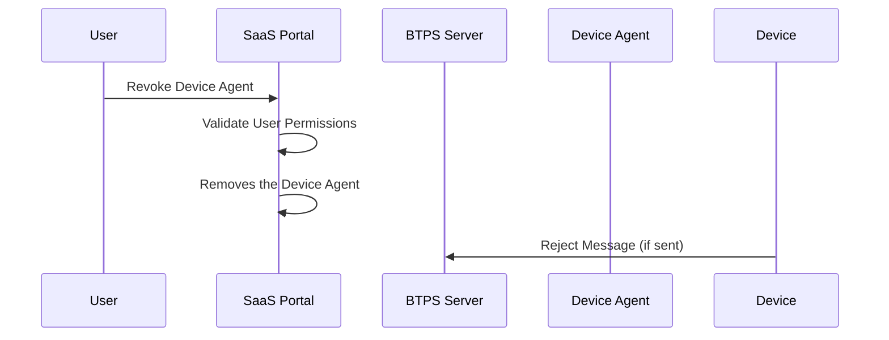
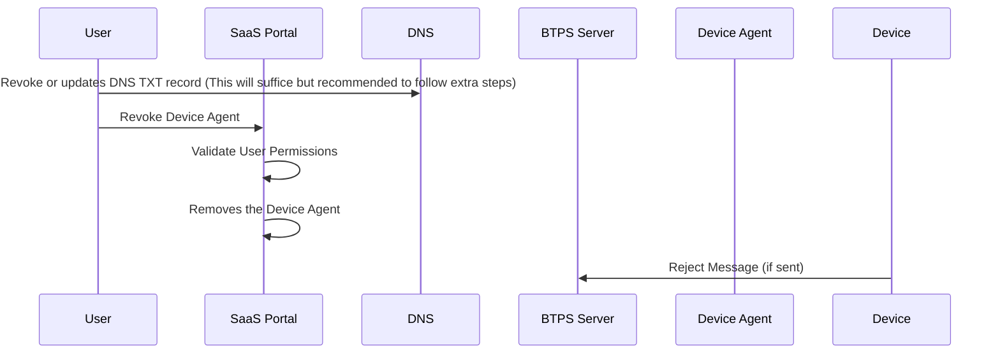

# BTPS Delegation Revocation

BTPS delegation revocation provides real-time control over device access by removing delegation records from DNS. This ensures immediate security when devices are lost, compromised, or no longer needed.

## 🎯 Purpose

Delegation revocation addresses critical security needs:

- **Device Loss**: Immediately revoke access when devices are lost or stolen
- **Security Breach**: Remove compromised device access
- **Access Control**: Manage device permissions and access lifecycle
- **Compliance**: Meet regulatory requirements for access termination

## Revocation process

Revocation process differs slightly based on the type of users that is fully managed vs partially managed users such as E2E users

### 🔄 Revocation Flow Overview (Fully managed Users)

**Users under SaaS domain**:

### Process Flow (Fully Managed Users)

The revocation process for fully managed users follows these steps:

1. **User Initiation**: The user initiates device revocation through the SaaS portal interface, selecting the specific device agent to revoke.

2. **Permission Validation**: The SaaS portal validates the user's permissions to ensure they have the authority to revoke the specified device agent. This includes checking user roles, ownership of the device, and any organizational policies.

3. **Device Removal**: Upon successful permission validation, the SaaS portal removes the device agent from the system. This includes:
   - Removing the device from the user's device list
   - Revoking any active authentication tokens
   - Updating internal delegation records
   - Clearing device-specific permissions

4. **Message Rejection**: If the revoked device attempts to send messages after revocation, the BTPS server will reject these messages due to the device no longer being authorized in the system.

This process provides immediate security control for SaaS-managed users, where all delegation records are centrally managed through the SaaS portal.

### 🔄 Revocation Flow Overview (Partially managed Users)

This flow applies for these users. Generally removing or updating DNS TXT record will be enough to stop the message. But We recommend to follow through all the steps as even though message cannot be sent, unwanted users can still able to view and read any incoming messages since authentication will still work until the expiry of the refresh token which can take days. Therefore, always remove the added device or refresh token via SaaS portal

- Users with Custom domain with Keys managed by SaaS
- E2E Users who manages their own Key with Custom domain and only inbox managed by SaaS

### Process Flow (Partially Managed Users)

The revocation process for partially managed users (such as those with custom domains or E2E users) follows these steps:

1. **DNS Record Update**: The user revokes or updates the relevant DNS TXT record for the device. This action alone is often sufficient to prevent further message delivery to the device, as the device will no longer be recognized as a valid delegate.

2. **SaaS Portal Revocation**: The user also initiates device revocation through the SaaS portal, ensuring that any active sessions or refresh tokens associated with the device are invalidated. This step is important because, even if message delivery is blocked, the device may still be able to authenticate and access messages until its token expires.

3. **Permission Validation**: The SaaS portal validates the user's permissions to perform the revocation, checking roles and device ownership as needed.

4. **Device Removal**: The SaaS portal removes the device agent from its records, revokes tokens, and updates any internal delegation or access lists.

5. **Message Rejection**: If the revoked device attempts to send messages after these steps, the BTPS server will reject them, as the device is no longer authorized either via DNS or SaaS records.

This comprehensive process ensures that both DNS-based and SaaS-managed controls are enforced, providing strong security even for users who manage their own keys or domains.

## 🛡️ Security Best Practices

### **Revocation Policies**

1. **Immediate Action**: Revoke devices immediately upon security incident
2. **Regular Review**: Periodically review and clean up unused delegations
3. **Audit Logging**: Log all revocation actions with timestamps and reasons
4. **User Notification**: Notify users of device revocations via email/SMS
5. **Recovery Procedures**: Provide clear re-authentication instructions

### **DNS Security**

1. **Low TTL**: Use short TTL (60-300 seconds) for fast revocation propagation
2. **Monitoring**: Monitor DNS propagation and alert on failures
3. **Backup Records**: Maintain backup of delegation records for recovery

### **Client Security**

1. **Token Validation**: Regularly validate access tokens
2. **Revocation Detection**: Implement revocation detection in clients
3. **Secure Storage**: Store credentials securely with encryption
4. **Auto-Cleanup**: Clear credentials when revocation detected
