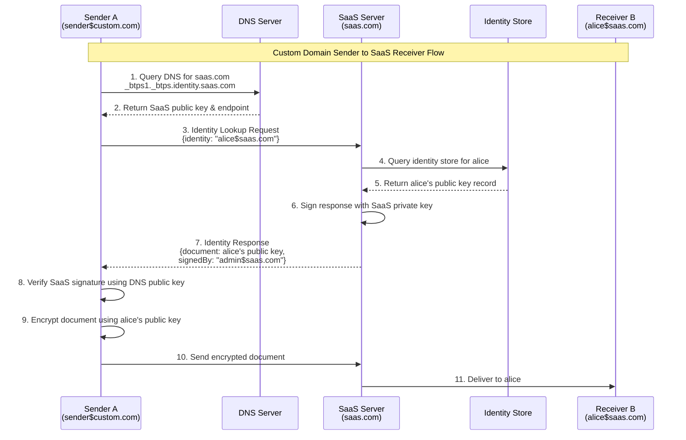
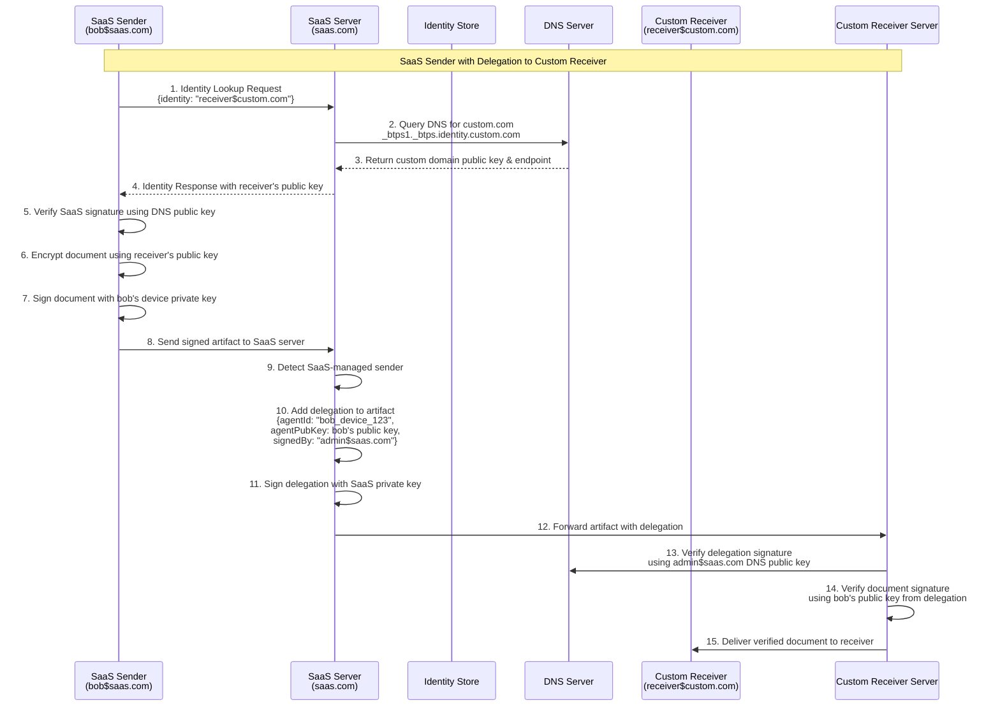
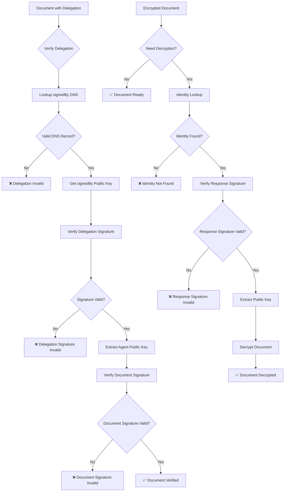

# BTPS Identity Record

## Overview

The BTPS protocol uses an identity record system to enable secure document exchange for users who don't own custom domains but are managed under SaaS platforms. This system solves the critical problem of public key discovery for SaaS-managed identities without requiring individual DNS records for each user.

Identity records serve as a centralized, secure way for SaaS platforms to publish public keys and selectors for their managed users, enabling end-to-end encryption and signature verification without the overhead of managing millions of individual DNS TXT records.

---

## Problem Statement

### Traditional DNS-Based Key Discovery Limitations

In the standard BTPS protocol, public keys are discovered through DNS TXT records:

```
_btps1._btps.identity.user.domain.com
```

**Challenges for SaaS Platforms:**

1. **Scale Limitations**: SaaS platforms like `ebilladdress.com` cannot feasibly publish DNS records for millions of users
2. **Management Overhead**: Individual DNS record management becomes prohibitively expensive
3. **Performance Degradation**: High DNS query volume degrades performance
4. **Operational Complexity**: Key rotation, revocation, and updates become unmanageable

### Example Scenario

```
SaaS Platform: ebilladdress.com
Users: alice@ebilladdress.com, bob@ebilladdress.com, charlie@ebilladdress.com
BTPS Identities: alice$ebilladdress.com, bob$ebilladdress.com, charlie$ebilladdress.com

Problem: Cannot publish DNS records for each user
Solution: Identity Record system for centralized key management
```

---

## Identity Record Flow

### Basic Flow (Custom Domain Sender to SaaS Receiver)



### Delegation Flow (SaaS Sender to Custom Domain Receiver)



### Verification Chain Flow



---

## Identity Record Structure

### Identity Lookup Request

```json
{
  "version": "1.0.0.0",
  "id": "identity_lookup_123456",
  "issuedAt": "2025-01-15T10:30:00Z",
  "identity": "alice$saas.com",
  "from": "sender$domain.com",
  "hostSelector": "btps1",
  "identitySelector": "btps1"
}
```

**Fields:**

- `version`: BTPS protocol version
- `id`: Unique request identifier
- `issuedAt`: Request timestamp (ISO format)
- `identity`: Target identity to lookup
- `from`: Requesting identity
- `hostSelector`: DNS selector for host resolution
- `identitySelector`: Optional selector for identity key rotation

### Identity Response Document

```json
{
  "version": "1.0.0.0",
  "status": {
    "ok": true,
    "code": 200,
    "message": "success"
  },
  "id": "identity_resp_789012",
  "issuedAt": "2025-01-15T10:30:15Z",
  "type": "btps_response",
  "reqId": "identity_lookup_123456",
  "document": {
    "selector": "btps1",
    "publicKey": "-----BEGIN PUBLIC KEY-----\nMIIBIjANBgkqhkiG9w0BAQEFAAOCAQ8A...\n-----END PUBLIC KEY-----",
    "keyType": "rsa",
    "version": "1.0.0.0"
  },
  "signedBy": "admin$saas.com",
  "selector": "btps1",
  "signature": {
    "algorithmHash": "sha256",
    "value": "base64-encoded-signature",
    "fingerprint": "sha256-base64-fingerprint"
  }
}
```

**Response Fields:**

- `document`: Identity public key information
- `signedBy`: SaaS platform identity that signed the response
- `selector`: Key selector for rotation management
- `signature`: Cryptographic signature by SaaS platform

---

## Implementation Details

### Server-Side Implementation

The `BtpsServer` handles identity lookup requests through the `handleIdentityLookup` method:

```typescript
private async handleIdentityLookup(
  artifact: BTPIdentityLookupRequest,
  context: { req: BTPRequestCtx; res: BTPResponseCtx }
) {
  const { identity, hostSelector, identitySelector } = artifact;

  // Compute identity ID
  const computedId = computeId(identity);

  // Lookup identity record from store
  const identityRecord = await this.identityStore?.getPublicKeyRecord(
    computedId,
    identitySelector
  );

  if (!identityRecord) {
    return this.sendBtpsError(res.socket, BTP_ERROR_IDENTITY_NOT_FOUND, res.reqId);
  }

  // Prepare response document
  const { createdAt, ...restRecord } = identityRecord;
  const data: BTPServerResponse = {
    ...this.prepareBtpsResponse({ ok: true, message: 'success', code: 200 }, res.reqId),
    type: 'btps_response',
    selector: hostSelector,
    document: restRecord,
    signedBy: this.serverIdentity.identity,
  };

  // Sign response with server private key
  const signature = signBtpPayload(data, serverPemKeys);

  this.sendBtpsResponse(res.socket, { ...data, signature }, 'end');
}
```

### Client-Side Implementation

The `BtpsAgent` resolves identity information during encryption:

```typescript
protected async buildTransportArtifact(commandParams: BtpsAgentCommandParams) {
  const { document, actionType, to, options } = commandParams;

  // Get receiver DNS information
  const receiverDnsTxt = options?.encryption
    ? (await this.resolveIdentity(to, this.options.to, this.keyPair.privateKey)).response
    : await this.resolveBtpsHostDnsTxt(to);

  if (!receiverDnsTxt) {
    return await this.buildClientErrorResponse(
      new BTPErrorException(BTP_ERROR_RESOLVE_DNS, {
        cause: `Could not resolve identity or host and selector for: ${to}`,
      })
    );
  }

  // Encrypt document if required
  if (options?.encryption) {
    const { publicKey } = receiverDnsTxt;
    const { data, encryption: encryptionInfo } = encryptBtpPayload(
      document,
      publicKey,
      options.encryption
    );
    encryptedDocument = data;
    encryption = encryptionInfo;
  }

  // Create and sign transporter artifact
  const transporterArtifact = {
    id: randomUUID(),
    issuedAt: new Date().toISOString(),
    version: this.getProtocolVersion(),
    type: artifactType,
    document: encryptedDocument,
    from: this.options.to,
    to: to,
    selector: receiverDnsTxt.selector,
    encryption: encryption,
  };

  const signature = signBtpPayload(transporterArtifact, this.keyPair);
  return { payload: { ...transporterArtifact, signature }, error: undefined };
}
```

---

## Security Model

### Trust Chain Verification

1. **DNS-Based Trust**: SaaS platform identity (e.g., `admin$saas.com`) must have DNS records published
2. **Signature Verification**: Identity lookup responses are signed by the SaaS platform
3. **Key Validation**: Public keys are verified against the signing identity's DNS record
4. **Delegation Support**: SaaS-managed users can delegate to platform-managed keys

### Delegation for SaaS-Managed Senders

When a SaaS-managed sender (without custom domain) needs to send documents:

```json
{
  "delegation": {
    "agentId": "alice_device_123",
    "agentPubKey": "-----BEGIN PUBLIC KEY-----\nMIIBIjANBgkqhkiG9w0BAQEFAAOCAQ8A...\n-----END PUBLIC KEY-----",
    "signedBy": "admin$saas.com",
    "issuedAt": "2025-01-15T10:30:00Z",
    "signature": {
      "algorithmHash": "sha256",
      "value": "base64-encoded-signature",
      "fingerprint": "sha256-base64-fingerprint"
    },
    "selector": "btps1"
  }
}
```

**Delegation Requirements:**

- `signedBy` identity must have DNS records published
- Delegation signature verified against DNS public key
- Agent public key included for chain verification
- SaaS platform manages delegation lifecycle

---

## Use Cases

### 1. SaaS-Managed Receiver

**Scenario**: Sender wants to send encrypted document to `alice$saas.com`

**Flow:**

1. Sender resolves `saas.com` DNS records
2. Sender sends identity lookup request to SaaS server
3. SaaS server returns `alice$saas.com` public key
4. Sender verifies SaaS signature using DNS public key
5. Sender encrypts document using alice's public key
6. Sender sends encrypted document to SaaS server

### 2. SaaS-Managed Sender

**Scenario**: `bob$saas.com` wants to send document to receiver

**Flow:**

1. SaaS platform creates delegation for bob's device
2. Delegation signed by `admin$saas.com` (DNS-published identity)
3. Bob's device signs document with device private key
4. Document includes delegation for verification
5. Receiver verifies delegation signature against DNS public key
6. Receiver verifies document signature against agent public key

### 3. Mixed Domain Scenario

**Scenario**: Custom domain sender to SaaS-managed receiver

**Flow:**

1. Custom domain sender (`sender$custom.com`) resolves SaaS DNS
2. Sender requests identity lookup for `alice$saas.com`
3. SaaS returns alice's public key with platform signature
4. Sender verifies platform signature using DNS records
5. Sender encrypts document using alice's public key
6. Document delivered to SaaS server for alice

---

## Identity Store Implementation

### AbstractIdentityStore Interface

```typescript
export abstract class AbstractIdentityStore<
  T extends BTPIdentityRecord,
> extends AbstractStorageStore<T> {
  abstract getPublicKeyRecord(
    identity: string,
    selector?: string,
  ): Promise<IdentityPubKeyRecord | undefined>;
}
```

### Identity Record Structure

```typescript
export interface BTPIdentityRecord extends BTPStorageRecord {
  identity: string; // unique identity of the storage record
  currentSelector: string; // unique selector of the storage record
  publicKeys: IdentityPubKeyRecord[]; // current base64 public key of the identity
}

export type IdentityPubKeyRecord = {
  selector: string;
  publicKey: string;
  keyType: 'rsa';
  version: string;
  createdAt: string;
};
```

### Storage Options

**File-Based Storage:**

```typescript
const identityStore = new JsonIdentityStore({
  connection: './data/identities.json',
  entityName: 'identities',
});
```

**Database Storage:**

```typescript
class DatabaseIdentityStore extends AbstractIdentityStore<BTPIdentityRecord> {
  async getPublicKeyRecord(identity: string, selector?: string) {
    // Database implementation
  }
}
```

---

## Key Management

### Key Rotation

1. **SaaS Platform**: Rotates platform keys via DNS records
2. **User Keys**: Rotated through identity store updates
3. **Selector Management**: Different selectors for different key versions
4. **Backward Compatibility**: Old keys remain valid during transition

### Key Lifecycle

```
Key Generation → Identity Store Storage → DNS Publication (if applicable) → Usage → Rotation → Revocation
```

### Security Considerations

- **Key Storage**: Secure storage of private keys
- **Access Control**: Limited access to identity store
- **Audit Logging**: Complete audit trail of key operations
- **Backup Strategy**: Secure backup of critical keys

---

## Error Handling

### Common Error Scenarios

1. **Identity Not Found**

   ```json
   {
     "ok": false,
     "code": 404,
     "message": "Identity not found",
     "type": "btps_error"
   }
   ```

2. **DNS Resolution Failed**

   ```json
   {
     "ok": false,
     "code": 500,
     "message": "Could not resolve DNS records",
     "type": "btps_error"
   }
   ```

3. **Signature Verification Failed**
   ```json
   {
     "ok": false,
     "code": 403,
     "message": "Signature verification failed",
     "type": "btps_error"
   }
   ```

### Error Recovery

- **Retry Logic**: Exponential backoff for transient failures
- **Fallback Mechanisms**: Alternative resolution methods
- **Graceful Degradation**: Continue with available information
- **Error Reporting**: Detailed error information for debugging

---

## Best Practices

### SaaS Platform Implementation

1. **Identity Store Setup**

   - Implement `AbstractIdentityStore` interface
   - Use secure storage (database or encrypted files)
   - Implement proper access controls

2. **Key Management**

   - Regular key rotation for platform keys
   - Secure key generation and storage
   - Backup and recovery procedures

3. **Delegation Management**
   - Automated delegation creation for users
   - Delegation lifecycle management
   - Revocation procedures

### Client Implementation

1. **DNS Resolution**

   - Implement proper DNS resolution
   - Handle DNS failures gracefully
   - Cache DNS results appropriately

2. **Identity Lookup**

   - Implement identity lookup requests
   - Verify response signatures
   - Handle lookup failures

3. **Encryption**
   - Use appropriate encryption algorithms
   - Handle encryption failures
   - Implement proper key management

### Security Considerations

1. **Trust Verification**

   - Always verify DNS-based signatures
   - Validate delegation chains
   - Check key fingerprints

2. **Access Control**

   - Implement proper authentication
   - Use least privilege principle
   - Audit all operations

3. **Monitoring**
   - Monitor identity lookup patterns
   - Track key usage and rotation
   - Alert on suspicious activity

---

## Compliance & Audit

### Regulatory Compliance

- **Data Protection**: GDPR, CCPA compliance for identity data
- **Financial Regulations**: SOX, PCI-DSS for financial data
- **Industry Standards**: ISO 27001, SOC 2 compliance

### Audit Requirements

- **Identity Operations**: Complete audit trail of identity operations
- **Key Management**: Audit trail of key generation, rotation, revocation
- **Access Logging**: Who accessed identity records and when
- **Compliance Reporting**: Automated compliance reporting

---

## Performance Considerations

### Scalability

1. **Identity Store Performance**

   - Use appropriate database indexes
   - Implement caching strategies
   - Optimize query patterns

2. **DNS Resolution**

   - Cache DNS results
   - Implement connection pooling
   - Use appropriate timeouts

3. **Network Optimization**
   - Minimize round trips
   - Use connection reuse
   - Implement proper error handling

### Monitoring

1. **Performance Metrics**

   - Identity lookup response times
   - DNS resolution times
   - Error rates and types

2. **Capacity Planning**
   - Monitor identity store growth
   - Track key rotation frequency
   - Plan for scale increases

---

## Why Identity Records Matter

- **SaaS Scalability**: Enables SaaS platforms to support millions of users
- **Security**: Maintains end-to-end encryption without DNS overhead
- **Flexibility**: Supports various deployment models
- **Compliance**: Enables regulatory compliance for identity management
- **Cost Efficiency**: Reduces DNS management costs
- **Performance**: Improves system performance through centralized management

---

**Legend:**

- **Identity Record**: Centralized storage for user public keys and selectors
- **Identity Lookup**: Protocol for discovering user public keys
- **SaaS Platform**: Service provider managing multiple user identities
- **Delegation**: Authorization mechanism for SaaS-managed users
- **DNS Resolution**: Traditional method for discovering platform public keys
- **Trust Chain**: Cryptographic verification chain from DNS to user keys
