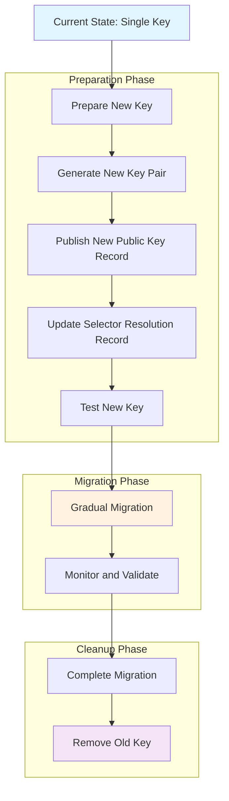
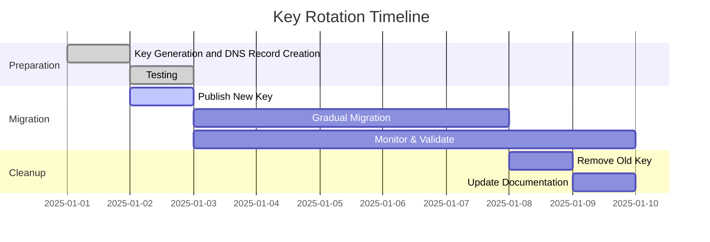

# Key Rotation in BTPS Protocol

Key rotation is a critical security practice that allows organizations to periodically change their cryptographic keys while maintaining backward compatibility and service continuity. The BTPS protocol implements a sophisticated key rotation mechanism using DNS-based selector resolution.

## Overview

Key rotation in BTPS enables organizations to:

- **Maintain security** by regularly updating cryptographic keys
- **Preserve backward compatibility** during key transitions
- **Support gradual migration** from old to new keys
- **Handle multiple key types** for different use cases
- **Ensure zero-downtime** key updates

## How Key Rotation Works

### DNS-Based Selector Resolution

BTPS uses DNS TXT records to publish multiple public keys under different selectors. This approach provides:

- **Decentralized key distribution** through DNS
- **Immediate key availability** without additional infrastructure
- **Flexible key management** with multiple selectors
- **Backward compatibility** during transitions

### Selector Naming Convention

Selectors can be any meaningful identifier and follow this naming pattern:

```
<selector>._btps.identity.<identity>.<domain>
```

**Examples:**

```
btps1._btps.identity.finance.vendorcorp.com  → First generation key
btps2._btps.identity.finance.vendorcorp.com  → Second generation key
current._btps.identity.finance.vendorcorp.com → Current production key
legacy._btps.identity.finance.vendorcorp.com  → Legacy key for backward compatibility
```

**Selector Guidelines:**

- Use descriptive names (e.g., `current`, `legacy`, `staging`, `2024q1`)
- Avoid generic numbers when possible
- Consider your key rotation strategy when naming
- Maintain consistency across your organization

### DNS TXT Record Formats

#### 1. Public Key Records

Each selector publishes a DNS TXT record with the following format:

```
btps1._btps.identity.finance.vendorcorp.com. IN TXT "v=1.0.0;k=rsa-sha256;p=MIIBIjANBgkqhkiG9w0BAQEFAAOCAQ8AMIIBCgKCAQEA..."
```

**Record Components:**

- `v=BTPS1` - Protocol version
- `k=rsa-sha256` - Key algorithm
- `p=<base64-encoded-public-key>` - Public key in PEM format

#### 2. Selector Resolution Records

The main BTPS selector record must be updated to include the current selector:

```
_btps.vendorcorp.com. IN TXT "v=1.0.0;u=btps.vendorcorp.com:3443;s=btps2"
```

**Record Components:**

- `v=1.0.0` - BTPS protocol version
- `u=<btps_host:port>` - BTPS server host and port
- `s=<selectorName>` - Current active selector for key resolution

**Important:** During key rotation, you must update the `s=` parameter to point to the new selector.

## Key Rotation Process Flow



**Key Steps:**

1. **Publish New Public Key Record**: Create DNS TXT record for new selector
2. **Update Selector Resolution Record**: Modify `_btps.<identity>.<domain>` to point to new selector
3. **Test Resolution**: Verify both records resolve correctly
4. **Gradual Migration**: Start using new selector while maintaining old one

## Preparation for Key Rotation

### 1. Key Generation and Validation

```bash
# Generate new key pair
openssl genrsa -out new_private_key.pem 2048
openssl rsa -in new_private_key.pem -pubout -out new_public_key.pem

# Validate key format
openssl rsa -in new_private_key.pem -check
```

### 2. DNS Record Preparation

Create the new DNS TXT records before publishing:

#### Public Key Record

```dns
btps2._btps.identity.finance.vendorcorp.com. IN TXT "v=BTPS1;k=rsa-sha256;p=MIIBIjANBgkqhkiG9w0BAQEFAAOCAQ8AMIIBCgKCAQEA..."
```

#### Selector Resolution Record

```dns
_btps.host.vendorcorp.com. IN TXT "v=1.0.0;u=btps.vendorcorp.com:3443;s=btps2"
```

**Note:** The selector resolution record (`_btps.host.vendorcorp.com`) must be updated to point to the new selector (`s=btps2`) during key rotation.

### 3. Testing Strategy

- **Test new key resolution** using DNS lookup tools
- **Verify artifact signing** with new key
- **Test artifact verification** with new public key
- **Validate backward compatibility** with old key

### 4. Monitoring Setup

- **DNS propagation monitoring** across different regions
- **Key resolution success rates**
- **Artifact verification statistics**
- **Error rate monitoring** for selector-related issues

## Key Rotation Implementation

### 1. Complete Key Rotation Workflow

The key rotation process involves updating two types of DNS records:

#### Step 1: Publish New Public Key Record

```dns
# Before rotation (existing record)
btps1._btps.finance.vendorcorp.com. IN TXT "v=BTPS1;k=rsa-sha256;p=OLD_PUBLIC_KEY"

# After rotation (new record added)
btps2._btps.finance.vendorcorp.com. IN TXT "v=BTPS1;k=rsa-sha256;p=NEW_PUBLIC_KEY"
```

#### Step 2: Update Selector Resolution Record

```dns
# Before rotation
_btps.finance.vendorcorp.com. IN TXT "v=1.0.0;u=btps.vendorcorp.com:3443;s=btps1"

# After rotation (updated to point to new selector)
_btps.finance.vendorcorp.com. IN TXT "v=1.0.0;u=btps.vendorcorp.com:3443;s=btps2"
```

### 2. Publishing Multiple Keys

```javascript
// Example: Publishing both old and new keys simultaneously
const oldSelector = 'btps1';
const newSelector = 'btps2';

// DNS TXT records (published simultaneously)
// Public Key Records:
// btps1._btps.finance.vendorcorp.com. IN TXT "v=BTPS1;k=rsa-sha256;p=OLD_PUBLIC_KEY"
// btps2._btps.finance.vendorcorp.com. IN TXT "v=BTPS1;k=rsa-sha256;p=NEW_PUBLIC_KEY"

// Selector Resolution Record (updated to point to new selector):
// _btps.finance.vendorcorp.com. IN TXT "v=1.0.0;u=btps.vendorcorp.com:3443;s=btps2"
```

### 2. Artifact Signing with Selectors

```javascript
import { BtpsClient } from '@btps/sdk';

const client = new BtpsClient({
  identity: 'alice$example.com',
  btpIdentityKey: 'PRIVATE_KEY',
  bptIdentityCert: 'PUBLIC_KEY',
});

// Sign artifact with new selector
const artifact = await client.send({
  to: 'bob$example.com',
  type: 'BTPS_DOC',
  selector: 'btps2', // Specify new selector
  document: {
    title: 'Invoice #123',
    // ... document content
  },
});
```

### 3. Verification with Selector Resolution

```javascript
// Verification automatically resolves the correct public key
// based on the selector in the artifact
const isValid = await verifyArtifact(artifact);
// Uses selector from artifact.selector to resolve public key
```

## Best Practices

### 1. Planning and Preparation

- **Schedule rotations** during low-traffic periods
- **Maintain key inventory** with creation and expiration dates
- **Document rotation procedures** for team reference
- **Test rotation process** in staging environment first
- **Plan realistic timelines**:
  - Preparation: 1 to 2 days
  - Migration: 1 to 2 weeks
  - Cleanup: 2 - 4 weeks for large platforms depending on messages queuing period

### 2. DNS Management

- **Use TTL values** appropriate for your rotation schedule
- **Monitor DNS propagation** across different regions
- **Implement DNS health checks** for key resolution
- **Maintain DNS backup** and recovery procedures

### 3. Key Security

- **Store private keys securely** using hardware security modules (HSMs) when possible
- **Implement key backup** and recovery procedures
- **Use strong key generation** algorithms and key sizes
- **Regularly audit key usage** and access patterns

### 4. Monitoring and Alerting

- **Monitor key resolution success rates**
- **Track artifact verification statistics**
- **Alert on selector-related errors**
- **Monitor DNS propagation delays**
- **Extended monitoring for large platforms**:
  - Track selector usage patterns over 2-3 months
  - Monitor for any systems still using old selectors
  - Alert on unexpected usage of deprecated keys
  - Generate migration progress reports

### 5. Rollback Strategy

- **Maintain old keys** during transition period (2-4 weeks minimum)
- **Implement quick rollback procedures** for immediate issues
- **Monitor for issues** that might require rollback
- **Document rollback decision criteria**
- **Extended key retention** for large platforms:
  - Keep old keys for 1 month after migration
  - Monitor for any systems still using old selectors
  - Gradual removal based on usage analytics

## Key Rotation Timeline



### Timeline Breakdown

#### Preparation Phase (1-2 days)

- **Key Generation**: 1 day
- **DNS Record Creation**: 1 day
- **Testing**: 1 day
- **Total**: 3 days maximum

#### Migration Phase (2 weeks)

- **Gradual Migration**: 1-2 weeks depending on infrastructure and user base
- **Monitoring & Validation**: Continuous during migration period
- **Key Factors**:
  - Number of users and systems
  - Geographic distribution
  - DNS propagation requirements
  - Application deployment cycles

#### Cleanup Phase (2-4 weeks for large platforms)

- **Remove Old Keys**: 2-4 weeks after migration completion
- **Recommended Timeline**:
  - **Small platforms** (< 10K users): 1-2 days
  - **Medium platforms** (10K-100K users): 1-2 weeks
  - **Large platforms** (> 1M users): 2-4 weeks
- **Rationale**: Ensures all cached DNS records expire and all systems have migrated

## Error Handling

### Common Issues and Solutions

#### 1. Selector Not Found

**Error:** `BTP_ERROR_SELECTOR_NOT_FOUND`

**Causes:**

- DNS record not published
- DNS propagation delay
- Incorrect selector name

**Solutions:**

- Verify DNS record publication
- Wait for DNS propagation
- Check selector naming convention

#### 2. Public Key Resolution Failure

**Error:** `BTP_ERROR_RESOLVE_PUBKEY`

**Causes:**

- Invalid DNS TXT record format
- Corrupted public key
- DNS resolution issues

**Solutions:**

- Validate DNS TXT record format
- Check public key encoding
- Verify DNS infrastructure

#### 3. Verification Failure

**Error:** Signature verification fails

**Causes:**

- Wrong public key used for verification
- Key mismatch between signing and verification
- Selector resolution issues

**Solutions:**

- Verify selector resolution
- Check key consistency
- Validate DNS records

## Implementation Examples

### Node.js Implementation

```javascript
import { BtpsClient, getHostAndSelector } from '@btps/sdk';

class KeyRotationManager {
  constructor(identity, privateKey, publicKey) {
    this.client = new BtpsClient({
      identity,
      btpIdentityKey: privateKey,
      bptIdentityCert: publicKey,
    });
  }

  async signWithSelector(selector, document, recipient) {
    return await this.client.send({
      to: recipient,
      type: 'BTPS_DOC',
      selector,
      document,
    });
  }

  async verifyArtifact(artifact) {
    // Verification automatically uses the selector from the artifact
    const { host, selector } = await getHostAndSelector(artifact.from);
    const publicKey = await resolvePublicKey(host, selector);
    return await verifySignature(artifact, publicKey);
  }
}
```

## Security Considerations

### 1. Key Compromise Response

If a key is compromised:

1. **Immediate action:** Publish new key with new selector
2. **Revoke compromised key:** Remove DNS TXT record
3. **Monitor for abuse:** Check for artifacts signed with compromised key
4. **Notify stakeholders:** Inform partners about key compromise
5. **Investigate:** Determine scope and cause of compromise

### 2. Key Lifecycle Management

- **Key creation:** Use secure key generation procedures
- **Key distribution:** Secure distribution of public keys
- **Key usage:** Monitor and log key usage patterns
- **Key archival:** Secure archival of retired keys
- **Key destruction:** Secure destruction of compromised keys

### 3. Audit and Compliance

- **Key rotation logs:** Maintain detailed logs of all key rotations
- **Access controls:** Implement strict access controls for key management
- **Regular audits:** Conduct regular security audits of key management
- **Compliance reporting:** Generate compliance reports for key management

## Troubleshooting Guide

### DNS Issues

```bash
# Check DNS resolution for public key records
dig TXT btps1._btps.identity.finance.vendorcorp.com
dig TXT btps2._btps.identity.finance.vendorcorp.com

# Check DNS resolution for selector record
dig TXT _btps.host.vendorcorp.com

# Check DNS propagation
nslookup btps1._btps.identity.finance.vendorcorp.com
nslookup btps2._btps.identity.finance.vendorcorp.com
nslookup _btps.host.vendorcorp.com
```

### Key Resolution Issues

```javascript
// Test key resolution
import { resolvePublicKey } from '@btps/sdk';

try {
  const publicKey = await resolvePublicKey('finance.vendorcorp.com', 'btps1');
  console.log('Key resolved successfully');
} catch (error) {
  console.error('Key resolution failed:', error);
}

// Test selector resolution
import { getHostAndSelector } from '@btps/sdk';

try {
  const { host, selector } = await getHostAndSelector('finance$vendorcorp.com');
  console.log('Host:', host);
  console.log('Selector:', selector);
} catch (error) {
  console.error('Selector resolution failed:', error);
}
```

### Verification Issues

```javascript
// Test artifact verification
import { verifyArtifact } from '@btps/sdk';

try {
  const isValid = await verifyArtifact(artifact);
  console.log('Verification result:', isValid);
} catch (error) {
  console.error('Verification failed:', error);
}
```

## Conclusion

Key rotation is a fundamental security practice that ensures the long-term security and integrity of BTPS communications. By following the guidelines and best practices outlined in this document, organizations can implement robust key rotation procedures that maintain security while ensuring service continuity.

The selector-based approach provides flexibility and backward compatibility, making key rotation a manageable process that can be executed with minimal disruption to ongoing operations.

For additional support and implementation guidance, refer to the [BTPS SDK documentation](../sdk/overview.md) and [API reference](../sdk/apiReference.md).
