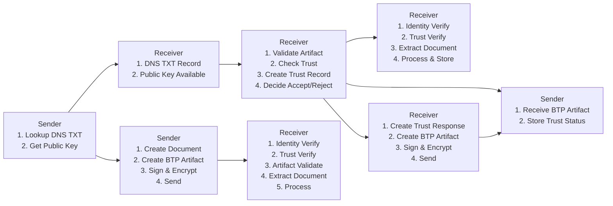
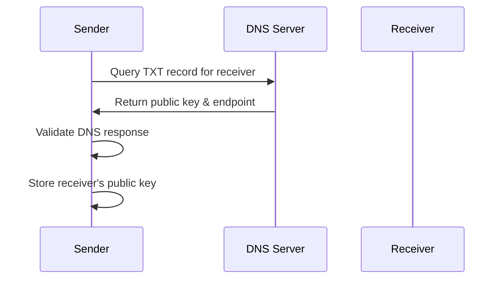
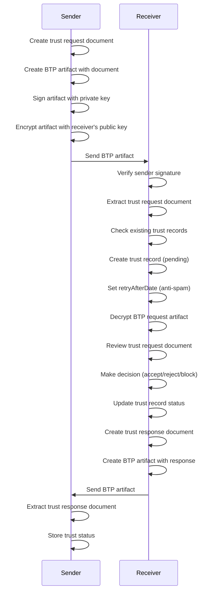
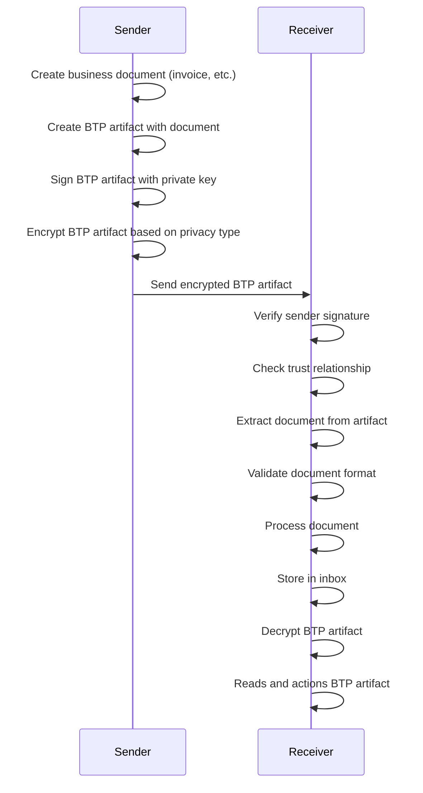
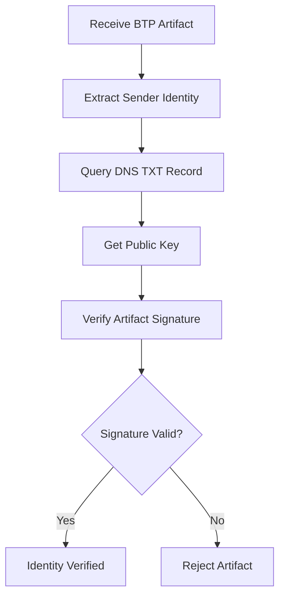
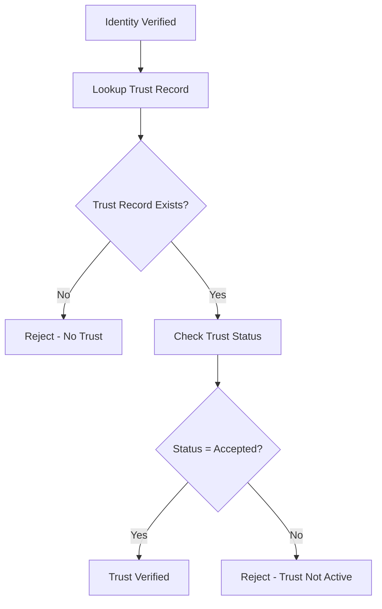
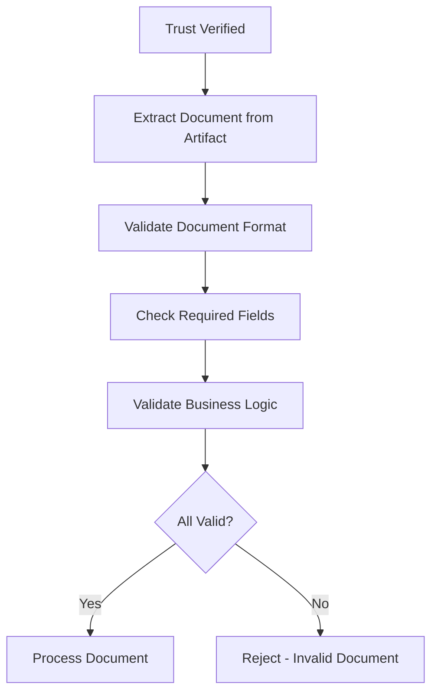

# BTPS Message transmission Flow

## Overview

The BTPS (Billing Trust Protocol Secure) message flow defines how **BTP Artifacts** are securely exchanged between organizations. A BTP Artifact is the complete message envelope that contains a **BTP Document** (the actual business content) along with metadata, signatures, and encryption.

**Key Distinction:**
- **BTP Artifact**: Complete message envelope with metadata, signatures, and encryption
- **BTP Document**: The actual business content inside the artifact (invoice, trust request, etc.)

This protocol ensures that only trusted, verified parties can send and receive sensitive business documents through a series of cryptographic and trust-based security checks.

---

## High-Level Message Flow



---

## BTP Artifact vs BTP Document

### BTP Artifact (Complete Message Envelope)
```json
{
  "version": "1.0",
  "issuedAt": "2025-01-15T10:30:00Z",
  "id": "btp_1234567890abcdef",
  "type": "btp_trust_request",
  "from": "billing$vendorcorp.com",
  "to": "pay$client.com",
  "document": {
    // BTP Document content goes here
  },
  "signature": {
    "algorithm": "sha256",
    "value": "base64-encoded-signature",
    "fingerprint": "sha256-base64-fingerprint"
  },
  "encryption": {
    "algorithm": "aes-256-cbc",
    "encryptedPayload": "base64-encoded-encrypted-document",
    "encryptedKey": "base64-encoded-encrypted-key",
    "iv": "base64-encoded-initialization-vector"
  }
}
```

### BTP Document (Business Content)
The `document` field contains the actual business content:

**Trust Request Document:**
```json
{
  "name": "Acme Corporation",
  "email": "billing@acme.com",
  "reason": "To send monthly service invoices",
  "phone": "+1-555-0123"
}
```

**Invoice Document:**
```json
{
  "title": "Monthly Service Invoice",
  "id": "INV-2025-001",
  "totalAmount": {
    "value": 1500.00,
    "currency": "USD"
  },
  "lineItems": {...}
}
```

---

## Detailed Message Flow Process

### Phase 1: Identity Discovery

**Purpose**: Establish cryptographic identity and discover communication endpoints.



**Steps:**
1. **DNS Lookup**: Sender queries receiver's DNS TXT record
2. **Key Extraction**: Extract public key and server endpoint from TXT record
3. **Validation**: Verify DNS response integrity and format
4. **Storage**: Store receiver's public key for future use

**DNS TXT Record Format:**
```
v=BTP1; k=rsa; p=<base64_public_key>; u=<btps_host:port>
```

---

### Phase 2: Trust Establishment

**Purpose**: Establish explicit, directional trust relationship between organizations.



**Trust Request Flow:**
1. **Document Creation**: Sender creates trust request document with business details
2. **Artifact Creation**: Sender creates BTP artifact containing the document
3. **Cryptographic Signing**: BTP artifact signed with sender's private key
4. **Encryption**: BTP artifact encrypted with receiver's public key
5. **Transmission**: Encrypted BTP artifact sent to receiver's BTPS server
6. **Decryption**: Receiver decrypts BTP artifact
7. **Verification**: Receiver verifies sender's identity via signature
8. **Document Extraction**: Receiver extracts trust request document from artifact
9. **Trust Record Creation**: Receiver creates trust record with `pending` status
10. **Anti-Spam Protection**: `retryAfterDate` set (recommended: 24 hours)
11. **Decision Process**: Receiver reviews trust request document and makes decision
12. **Response Creation**: Receiver creates trust response document
13. **Response Artifact**: Receiver creates BTP artifact with response document
14. **Response Transmission**: Trust response BTP artifact sent back to sender
15. **Storage**: Both parties store trust relationship status

**Trust Response Types:**
- **`accepted`**: Trust relationship established, documents can be sent
- **`rejected`**: Trust request denied, can retry after `retryAfterDate`
- **`blocked`**: Sender permanently blocked, no future requests allowed

---

### Phase 3: Document Exchange

**Purpose**: Securely exchange business documents between trusted parties.



**Document Exchange Flow:**
1. **Document Creation**: Sender creates business document (invoice, trust request, etc.)
2. **Artifact Creation**: Sender creates BTP artifact containing the document
3. **Cryptographic Signing**: BTP artifact signed with sender's private key
4. **Encryption**: BTP artifact encrypted based on agreed privacy type:
   - **`unencrypted`**: No encryption (public documents)
   - **`encrypted`**: Full end-to-end encryption (sensitive documents)
   - **`mixed`**: Selective encryption based on document type
5. **Transmission**: Encrypted BTP artifact sent to receiver's BTPS server
6. **Decryption**: Receiver decrypts BTP artifact
7. **Identity Verification**: Receiver verifies sender's cryptographic identity
8. **Trust Verification**: Receiver checks if sender is trusted
9. **Document Extraction**: Receiver extracts document from BTP artifact
10. **Document Validation**: Receiver validates document format and content
11. **Processing**: Document processed and delivered to receiver's application
12. **Storage**: Document stored in receiver's inbox system

---

## Security Verification Process

### Identity Verification


### Trust Verification


### Document Validation


---

## Message Types and Flow

### 1. Trust Request Artifact
**Purpose**: Establish trust relationship between organizations.

**Flow:**
```
Sender → Receiver: Trust Request BTP Artifact
Receiver → Sender: Trust Response BTP Artifact
```

**BTP Artifact Structure:**
```json
{
  "version": "1.0",
  "id": "trust_1234567890",
  "type": "btp_trust_request",
  "from": "billing$vendor.com",
  "to": "pay$client.com",
  "document": {
    "name": "Vendor Corp",
    "email": "billing@vendor.com",
    "reason": "To send monthly invoices",
    "phone": "+1-555-0123"
  },
  "signature": {...},
  "encryption": {...}
}
```

### 2. Trust Response Artifact
**Purpose**: Respond to trust requests with accept, reject, or block decision.

**Flow:**
```
Receiver → Sender: Trust Response BTP Artifact
```

**BTP Artifact Structure:**
```json
{
  "version": "1.0",
  "id": "response_1234567890",
  "type": "btp_trust_response",
  "from": "pay$client.com",
  "to": "billing$vendor.com",
  "document": {
    "decision": "accepted",
    "decidedAt": "2025-01-15T11:00:00Z",
    "decidedBy": "admin@client.com"
  },
  "signature": {...},
  "encryption": {...}
}
```

### 3. Invoice Artifact
**Purpose**: Send secure billing documents between trusted parties.

**Flow:**
```
Sender → Receiver: Invoice BTP Artifact
```

**BTP Artifact Structure:**
```json
{
  "version": "1.0",
  "id": "invoice_1234567890",
  "type": "btp_invoice",
  "from": "billing$vendor.com",
  "to": "pay$client.com",
  "document": {
    "title": "Monthly Service Invoice",
    "id": "INV-2025-001",
    "totalAmount": {
      "value": 1500.00,
      "currency": "USD"
    },
    "lineItems": {...}
  },
  "signature": {...},
  "encryption": {...}
}
```

---

## Error Handling and Recovery

### Common Error Scenarios

**1. Identity Verification Failures**
- Invalid DNS TXT record
- Expired or revoked public key
- Invalid cryptographic signature on BTP artifact
- **Recovery**: Contact sender to update DNS records

**2. Trust Verification Failures**
- No trust relationship exists
- Trust relationship expired
- Sender is blocked
- **Recovery**: Initiate new trust request process

**3. Document Validation Failures**
- Invalid document format within BTP artifact
- Missing required fields in document
- Business logic violations in document
- **Recovery**: Sender must correct and resend BTP artifact

### Error Response Codes
- **400 Bad Request**: Invalid BTP artifact format
- **401 Unauthorized**: Invalid signature or identity
- **403 Forbidden**: No trust relationship or blocked sender
- **404 Not Found**: Receiver not found or endpoint unavailable
- **429 Too Many Requests**: Rate limiting or spam protection
- **500 Internal Server Error**: Server processing error

---

## Performance and Scalability

### Throughput Considerations
- **Trust Requests**: ~100-1,000 BTP artifacts/second per server
- **Document Exchange**: ~10,000-100,000 BTP artifacts/second per server
- **DNS Lookups**: Cached to reduce latency
- **Cryptographic Operations**: Optimized for high throughput

### Scalability Features
- **Horizontal Scaling**: Multiple BTPS servers per organization
- **Load Balancing**: Distribute traffic across servers
- **Caching**: Cache DNS records and trust relationships
- **Async Processing**: Non-blocking BTP artifact processing

---

## Monitoring and Audit

### Message Tracking
- **Unique Artifact IDs**: Every BTP artifact has a unique identifier
- **Timestamps**: All operations timestamped for audit
- **Status Tracking**: Track BTP artifact delivery and processing status
- **Error Logging**: Comprehensive error logging and alerting

### Audit Requirements
- **Trust Decisions**: Who made what decision when
- **Document Flow**: Complete audit trail of BTP artifact exchange
- **Security Events**: Log all security-related events
- **Compliance Reporting**: Automated compliance reporting

---

## Summary

The BTPS message flow ensures secure, trusted, and verifiable document exchange through:

1. **Identity Discovery**: DNS-based identity resolution
2. **Trust Establishment**: Explicit, directional trust relationships
3. **Secure Exchange**: Cryptographically signed and encrypted BTP artifacts
4. **Document Processing**: Extraction and validation of BTP documents from artifacts
5. **Verification**: Multi-layer security verification at every step
6. **Audit Trail**: Complete logging for compliance and security

**Key Concepts:**
- **BTP Artifact**: Complete message envelope with metadata, signatures, and encryption
- **BTP Document**: Business content (invoice, trust request, etc.) contained within the artifact
- **Trust Relationship**: Explicit, directional trust between organizations
- **Cryptographic Security**: End-to-end encryption and digital signatures

This protocol provides enterprise-grade security while maintaining high performance and scalability for business document exchange.