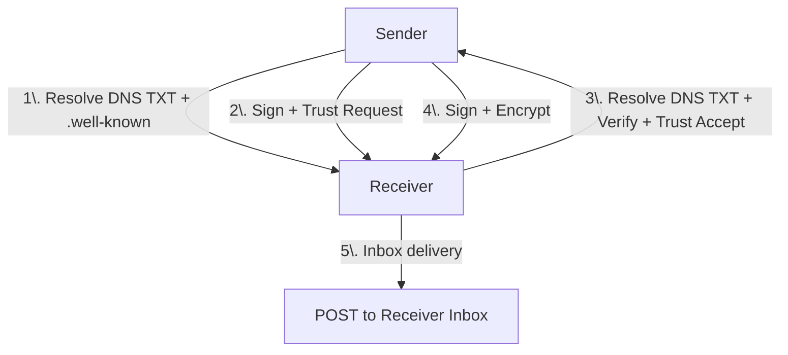

# BTPS Protocol Overview

## Introduction

BTPS (Billing Trust Protocol Secure) is a trust-based, cryptographically verifiable protocol for secure, consent-based exchange of billing documents and trust relationships. It is inspired by DKIM but specialized for billing/invoice workflows, with robust identity, trust, and key rotation mechanisms. Only trusted users can send bills/invoices. The protocol uses TLS for transport security.

## Protocol Architecture

### Visual Protocol Flow



Or, as ASCII:

```
┌────────────┐      DNS TXT + .well-known       ┌─────────────┐
│            │  ─────────────────────────────▶  │             │
│            │     (Sign + Trust Request)       │             │
│  Sender    │  ─────────────────────────────▶  │  Receiver   │ ────▶ Inbox
│            │     (Verify + Trust Accept)      │             │
└────────────┘ ◀─────────────────────────────── └─────────────┘
       │                                               ▲
       ▼                                               │
    [Sign + Encrypt]                                   │
       │                                               │
       └───────────────────────────────────────────────┘
```

## Key Concepts

| Concept             | Description                                                       |
| ------------------- | ----------------------------------------------------------------- |
| `btps-address`      | Like email, but uses `$`: e.g. `finance$company.com`              |
| DNS Discovery       | TXT records used to verify public keys and protocol support       |
| `.well-known` Trust | Trust records published at `/.well-known/btps-trust.json`         |
| Consent Handshake   | Sender must initiate a trust request, and be approved             |
| Signed Delivery     | All messages are signed + encrypted using public key cryptography |
| Inbox               | Self-hosted or SaaS-based inbox endpoints handle delivery         |

## Protocol Flow: Step by Step

### 1. Discovery

Sender does a DNS Host and Identity TXT lookup for:

- `_btps.host.vendor.com` - Host lookup retrieves:

  - version
  - host address
  - selector key for protocol support.

- `btps1._btps.identity.finance.vendor.com` - Identity lookup retrieves:
  - key type
  - version and
  - public key for protocol support.

### 2. Request Consent

Sender creates a signed handshake request and sends it to the receiver. In this step, sender optionally can define expiry date, encryption type, etc.

### 3. Receiver Accepts, Rejects or blocks temporarily or permanently

- If accepted, receiver adds sender to `btps-trust.json`
- If rejected, no messages are allowed
- If temporary blocks, no messages are allowed until retryDate passes
- If permanently blocks, no messages are allowed until manual intervention by the receiver

Once a trust relationship exists with any status including pending, additional trust requests from that sender are blocked. SaaS implementations may support temporary auto-blocks or auto release, while permanent blocks persist until manually modified by the user which may be allowed by the SaaS platform.

### 4. Message Delivery

Only after trust is established can sender post signed+encrypted messages to receiver's inbox.

### 5. Revocation

Receiver can revoke trust any time by updating `.well-known/btps-trust.json` or trust storage eg: database. Only trust with dual binding records are need to approved by both parties (Future additions)

## Goals

- Reduce spam and unauthorized billing messages
- Enable federated, DNS-based identity without central authority
- Support SaaS and self-hosted workflows
- Provide cryptographic security and audit trails
- Enable automated trust establishment and key rotation

## Problems we solved

Sending and receiving bills, whether via email or online systems, involves numerous user problems and pain points. Here are the key issues and how SaaS solutions can address them:

## �� User Problems

### Security & Trust Issues

- **Data Security Concerns**: Users worry about sensitive financial information being compromised during transmission
- **Identity Verification**: Difficulty in verifying the authenticity of billing entities
- **Fraud Vulnerability**: Risk of fake invoices and business email compromise attacks

### Integration & Workflow Problems

- **Poor System Integration**: Billing systems don't connect well with accounting software, CRM systems, or ERP platforms
- **Manual Data Entry**: Time-consuming manual processes for invoice processing and reconciliation
- **Inconsistent Formats**: Different vendors use various invoice formats and standards

### Operational Inefficiencies

- **Payment Complexity**: Multiple payment methods and processes across different vendors
- **Tracking Difficulties**: Poor visibility into payment status and invoice lifecycle
- **Notification Gaps**: Inadequate alerts for due dates, leading to late payments and penalties

### Accessibility & User Experience

- **Platform Complexity**: Difficult navigation for non-technical users
- **Accessibility Barriers**: Limited support for users with disabilities
- **Mobile Limitations**: Poor mobile experience for on-the-go bill management

## 🛠️ SaaS Solutions

### Enhanced Security & Trust

- **End-to-End Encryption**: Secure transmission of all billing data
- **Cryptographic Verification**: Digital signatures and identity verification
- **Fraud Prevention**: Automated detection of suspicious billing patterns
- **Audit Trails**: Complete logging of all billing transactions

### Seamless Integration

- **API-First Design**: Easy integration with existing business systems
- **Standardized Formats**: Consistent invoice and payment formats
- **Automated Workflows**: Reduced manual intervention in billing processes
- **Real-time Sync**: Instant updates across all connected platforms

### Streamlined Operations

- **Unified Payment Processing**: Single platform supporting multiple payment methods
- **Smart Notifications**: Intelligent alerts via preferred communication channels
- **Automated Reconciliation**: Automatic matching of payments to invoices
- **Advanced Analytics**: Insights into billing patterns and cash flow

### Improved User Experience

- **Intuitive Design**: User-friendly interfaces for all skill levels
- **Mobile Optimization**: Full functionality across all devices
- **Accessibility Compliance**: WCAG-compliant design for inclusive access
- **Customization Options**: Personalized dashboards and notification preferences

## 🌟 Additional Benefits

### Environmental Impact

- **Paperless Operations**: Complete digital transformation reducing environmental footprint
- **Carbon Footprint Reduction**: Lower energy consumption compared to traditional billing

### Cost Efficiency

- **Reduced Processing Costs**: Automation lowers manual processing expenses
- **Faster Payment Cycles**: Improved cash flow through streamlined processes
- **Compliance Automation**: Reduced regulatory compliance overhead

### Scalability

- **Enterprise-Ready**: Scales from small businesses to global corporations
- **Multi-Currency Support**: Handles international billing requirements
- **Cloud Infrastructure**: Reliable, always-available service

By addressing these core pain points with modern, secure, and user-centered SaaS solutions, organizations can transform their billing processes from a source of frustration into a competitive advantage.

## Trust via `.well-known` for Lightweight and Self Hosting

The `.well-known` directory is designed for simple or self-hosted BTPS servers. By default, trust records are stored as a JSON file (`btps-trust.json`) inside the `.well-known` directory. This approach is ideal for small vendors or those who want zero-infrastructure, file-based trust management.

For larger organizations or advanced deployments, BTPS supports pluggable trust storage. You can implement your own TrustStore backend by extending the `AbstractTrustStore` class provided by the SDK. This allows you to connect to any database system you prefer (e.g., MongoDB, SQL, cloud storage) by implementing the required methods for trust management.

- **Simple/self-hosted:** Use `.well-known/btps-trust.json` (default)
- **Enterprise/advanced:** Implement a custom TrustStore (e.g., database-backed) by extending `AbstractTrustStore`

This flexibility ensures BTPS can scale from static file hosting to full enterprise integration.

## Security Best Practices

### Cryptographic Security

- **Key Strength**: Use RSA-2048+ or Ed25519 keys
- **Key Rotation**: Implement regular key rotation using selectors
- **Algorithm Selection**: Use SHA-256 for signatures, AES-256-CBC for encryption
- **Random Generation**: Use cryptographically secure random number generators

### Network Security

- **TLS Transport**: Always use TLS 1.2+ for all communications
- **Certificate Validation**: Validate TLS certificates properly
- **DNSSEC**: Enable DNSSEC to protect identity records from tampering
- **Firewall Rules**: Restrict access to BTPS ports (default 3443)

### Identity Management

- **Domain Control**: Only publish identity records for domains you control
- **Key Storage**: Store private keys securely with appropriate access controls
- **Identity Verification**: Verify sender identities before establishing trust
- **Regular Audits**: Periodically audit trust relationships and key usage

### Trust Management

- **Trust Validation**: Always verify trust before accepting messages
- **Privacy Enforcement**: Enforce agreed privacy requirements strictly
- **Trust Expiration**: Monitor and renew trust relationships before expiration
- **Access Control**: Implement proper access controls for trust store management

### Operational Security

- **Logging**: Log all trust operations and message deliveries
- **Monitoring**: Monitor for unusual patterns or failed verification attempts
- **Backup**: Regularly backup trust stores and key materials
- **Incident Response**: Have procedures for key compromise and trust revocation

## License

Apache 2.0 — Open to all contributors committed to consent-first, privacy-safe infrastructure.
