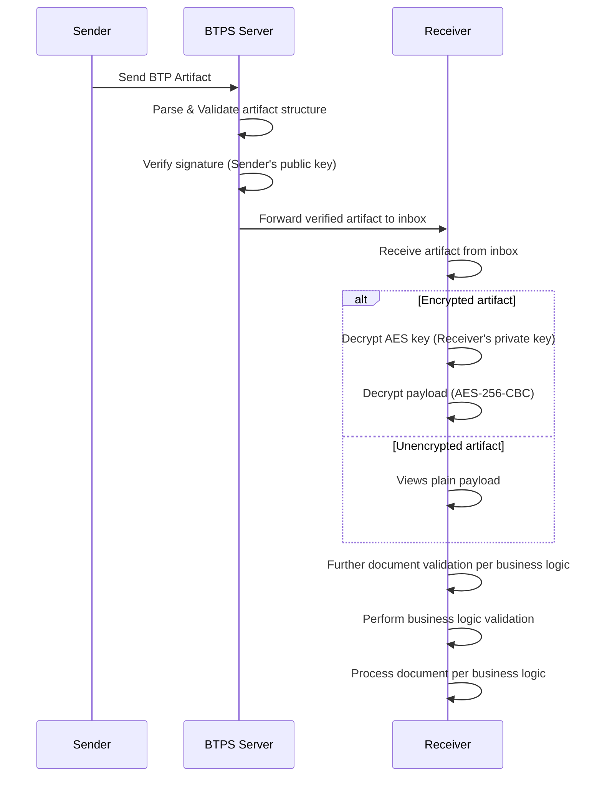

# Decryption & Verification in BTPS

BTPS ensures that only the intended recipient can decrypt and verify the authenticity of received messages. The process combines asymmetric and symmetric cryptography, as well as digital signature verification.

## Decryption & Verification Workflow

1. **Artifact Reception:** BTPS server receives the BTP Artifact from sender.
2. **Artifact Validation:** BTPS server validates the artifact structure and format.
3. **Signature Verification:** BTPS server verifies the sender's digital signature using the sender's public key (from DNS or .well-known).
4. **Forward to Receiver:** BTPS server forwards the verified artifact to the receiver's inbox endpoint.
5. **Receiver Processing:** Receiver obtains the BTP Artifact from their inbox endpoint.
6. **Key Decryption:** If the artifact is encrypted, receiver decrypts the AES key using their private RSA key.
7. **Payload Decryption:** If encrypted, receiver decrypts the payload using the AES key and IV. If not encrypted, the payload is used as-is.
8. **Document Extraction:** The decrypted (or plain) payload is parsed into the original document.
9. **Business Logic Validation:** Receiver performs additional validation specific to their SaaS platform or business requirements.
10. **Process & Action:** The document is further processed by the receiver and action is then performed accordingly per business logic.

## How `decryptVerify` Works
- The BTPS client uses the `decryptVerify` function to:
  1. Validates the artifact structure and format
  2. Parse the sender's identity and resolve their public key.
  3. Verify the artifact's signature using the sender's public key.
  4. If the artifact's `encryption` field is present, decrypt the AES key and then the payload.
  5. If the artifact is unencrypted (`encryption` is null), use the payload as-is after signature verification.
  6. Return the verified and decrypted (or plain) document for further processing.

## BTPS Server Role
**Important:** The BTPS server validates artifact structure and verifies the sender's digital signature to ensure message authenticity and integrity. It does **not** decrypt artifacts as user or user controlled platform owns the private key to decrypt. Decryption and additional business logic validation are performed by the receiver's client application after receiving the artifact.

## Sequence Diagram



## Example Decrypted Artifact

```json
{
  "document": {
    "title": "Monthly Service Invoice",
    "id": "INV-2025-001",
    "totalAmount": {
      "value": 1500.00,
      "currency": "USD"
    },
    "lineItems": {...}
  },
  "signature": {
    "algorithm": "sha256",
    "value": "...",
    "fingerprint": "..."
  }
}
```

## Notes
- If signature verification fails, the artifact is rejected.
- If decryption fails, the artifact is rejected and an error is logged.
- If the artifact is unencrypted, only signature verification is performed.
- Only after successful verification and decryption (if needed) is the document processed.
- The BTPS server acts as a trusted intermediary that verifies signatures but does not decrypt content. 