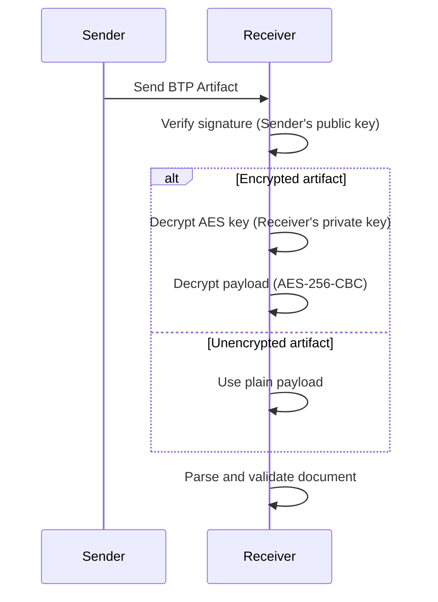

# Decryption & Verification in BTPS

BTPS ensures that only the intended recipient can decrypt and verify the authenticity of received messages. The process combines asymmetric and symmetric cryptography, as well as digital signature verification.

## Decryption & Verification Workflow

1. **Artifact Reception:** Receiver obtains the BTP Artifact from their inbox endpoint.
2. **Signature Verification:** Receiver verifies the sender's digital signature using the sender's public key (from DNS or .well-known).
3. **Key Decryption:** If the artifact is encrypted, receiver decrypts the AES key using their private RSA key.
4. **Payload Decryption:** If encrypted, receiver decrypts the payload using the AES key and IV. If not encrypted, the payload is used as-is.
5. **Document Extraction:** The decrypted (or plain) payload is parsed into the original document.
6. **Validation:** The document is validated for structure and business logic.

## How `decryptVerify` Works
- The BTPS client uses the `decryptVerify` function to:
  1. Parse the sender's identity and resolve their public key.
  2. Verify the artifact's signature using the sender's public key.
  3. If the artifact's `encryption` field is present, decrypt the AES key and then the payload.
  4. If the artifact is unencrypted (`encryption` is null), use the payload as-is after signature verification.
  5. Return the verified and decrypted (or plain) document for further processing.

## Sequence Diagram



## Example Decrypted Artifact

```json
{
  "document": {
    "title": "Monthly Service Invoice",
    "id": "INV-2025-001",
    "totalAmount": {
      "value": 1500.00,
      "currency": "USD"
    },
    "lineItems": {...}
  },
  "signature": {
    "algorithm": "sha256",
    "value": "...",
    "fingerprint": "..."
  }
}
```

## Notes
- If signature verification fails, the artifact is rejected.
- If decryption fails, the artifact is rejected and an error is logged.
- If the artifact is unencrypted, only signature verification is performed.
- Only after successful verification and decryption (if needed) is the document processed. 