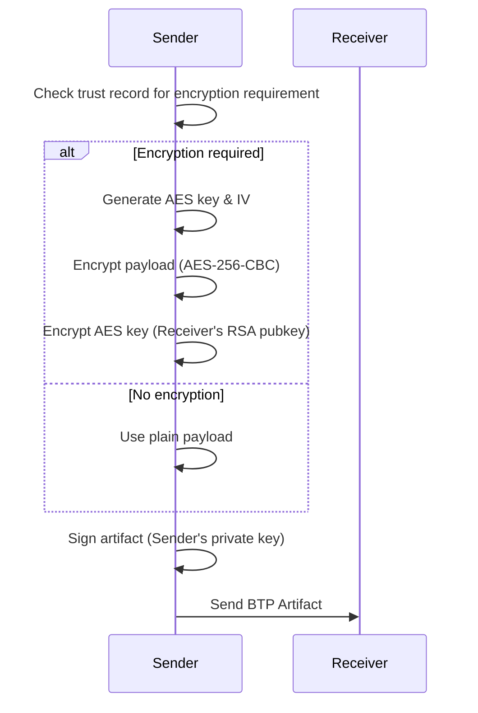

# Encryption Process in BTPS

BTPS uses a hybrid encryption approach to ensure that messages are both confidential and verifiable. The process combines asymmetric (public-key) and symmetric encryption, along with digital signatures.

## Encryption Workflow

1. **Key Discovery:** Sender retrieves the receiver's public key from DNS or `.well-known`.
2. **Payload Preparation:** Sender prepares the message/document to be sent.
3. **Symmetric Key Generation:** Sender generates a random AES-256 key and IV.
4. **Payload Encryption:** The message is encrypted using AES-256-CBC with the generated key and IV.
5. **Key Encryption:** The AES key is encrypted using the receiver's public RSA key (RSA-OAEP).
6. **Message Signing:** The sender signs the encrypted payload and metadata with their private key (SHA-256).
7. **Artifact Assembly:** The encrypted payload, encrypted key, IV, and signature are assembled into a BTP Artifact.
8. **Transmission:** The artifact is sent to the receiver's endpoint.

## Optional Encryption (Based on Trust Record)
- The trust record between sender and receiver determines if encryption is required.
- If encryption is not required, the payload is sent as plain text and the `encryption` field in the artifact is `null`.
- If encryption is required, the full encryption workflow above is followed.

## How `signEncrypt` Works
- The BTPS client uses the `signEncrypt` function to:
  1. Check the trust record and encryption options.
  2. Encrypt the payload if required, or leave it as plain text if not.
  3. Sign the artifact (including the payload and encryption metadata) with the sender's private key.
  4. Return the signed (and possibly encrypted) artifact for transmission.

## Sequence Diagram



## Example BTP Artifact Structure

```json
{
  "algorithm": "aes-256-cbc",
  "encryptedKey": "...",
  "iv": "...",
  "type": "standardEncrypt",
  "document": "...", // Encrypted payload (base64) or plain text
  "signature": {
    "algorithm": "sha256",
    "value": "...",
    "fingerprint": "..."
  }
}
```

## Signing Process

See [Signature](/docs/protocol/security/signature-verification) for full details.

## Notes
- The encrypted AES key and IV allow only the intended receiver to decrypt the payload.
- If the artifact is unencrypted, only the signature is used for verification.
- The artifact structure is versioned and extensible for future algorithm support. 