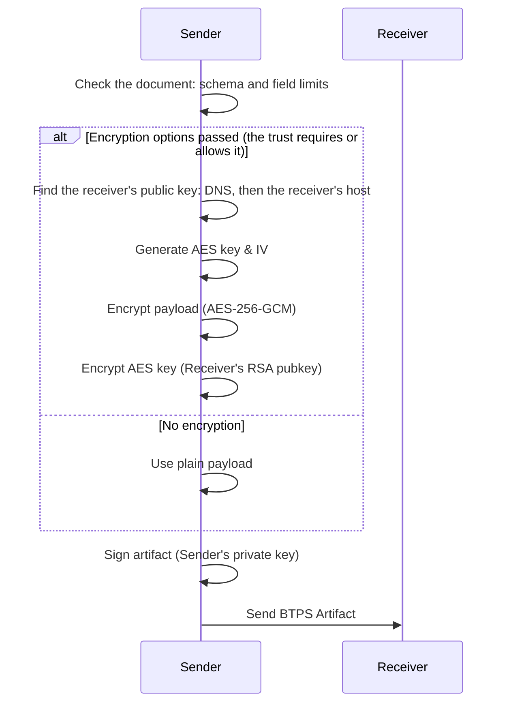

# Encryption Process in BTPS

BTPS uses a hybrid encryption approach to ensure that messages are both confidential and verifiable. The process combines asymmetric (public-key) and symmetric encryption, along with digital signatures.

## Encryption Workflow

1. **Key Discovery:** Sender retrieves the receiver's public key from DNS, or from the receiver's host when it is not in DNS (accepted only if signed by the domain's operator).
2. **Payload Preparation:** Sender prepares the message/document to be sent, and checks it against its type's schema and field limits.
3. **Symmetric Key Generation:** Sender generates a random AES-256 key and IV.
4. **Payload Encryption:** The message is encrypted using AES-256-GCM with the generated key and IV.
5. **Key Encryption:** The AES key is encrypted using the receiver's public RSA key (RSA-OAEP).
6. **Message Signing:** The sender signs the encrypted payload and metadata with their private key (SHA-256).
7. **Artifact Assembly:** The encrypted payload, encrypted key, IV, and signature are assembled into a BTPS Artifact.
8. **Transmission:** The artifact is sent to the receiver's endpoint.

## Optional Encryption (Based on Trust Record)

- The trust record between sender and receiver determines if encryption is required. The receiver's server enforces it: an artifact sent in the clear over a trust that requires encryption is refused (`BTP_ERROR_PRIVACY_TYPE`).
- If encryption is not required, the payload is sent as plain text and the `encryption` field in the artifact is `null`.
- If encryption is required, the full encryption workflow above is followed.

## How `signEncrypt` Works

- The BTPS client uses the `signEncrypt` function to:
  1. Check the document against its type's schema and field limits.
  2. If the caller passed `encryption` options, find the receiver's public key (DNS first, then the receiver's host) and encrypt the payload; otherwise leave it as plain text. `signEncrypt` does not read trust records: the caller decides, from the trust it holds.
  3. Sign the artifact (including the payload and encryption metadata) with the sender's private key.
  4. Return the signed (and possibly encrypted) artifact for transmission.

## Sequence Diagram


```mermaid
sequenceDiagram
    participant Sender
    participant Receiver
    Sender->>Sender: Check the document: schema and field limits
    alt Encryption options passed (the trust requires or allows it)
        Sender->>Sender: Find the receiver's public key: DNS, then the receiver's host
        Sender->>Sender: Generate AES key & IV
        Sender->>Sender: Encrypt payload (AES-256-GCM)
        Sender->>Sender: Encrypt AES key (Receiver's RSA pubkey)
    else No encryption
        Sender->>Sender: Use plain payload
    end
    Sender->>Sender: Sign artifact (Sender's private key)
    Sender->>Receiver: Send BTPS Artifact
```

## Example BTPS Artifact Structure

```json
{
  "algorithm": "aes-256-gcm",
  "encryptedKey": "...",
  "iv": "...",
  "authTag": "...",
  "type": "standardEncrypt",
  "document": "...", // Encrypted payload (base64) or plain text
  "signature": {
    "algorithmHash": "sha256",
    "value": "...",
    "fingerprint": "..."
  }
}
```

## Signing Process

See [Signature](/docs/protocol/security/signature-verification) for full details.

## Notes

- The encrypted AES key and IV allow only the intended receiver to decrypt the payload.
- If the artifact is unencrypted, only the signature is used for verification.
- The artifact structure is versioned and extensible for future algorithm support.
