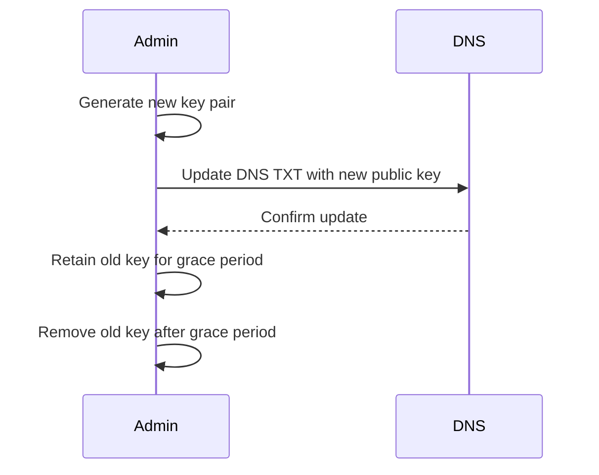

# Key Management in BTPS

Proper key management is essential for maintaining the security and trust of the BTPS protocol. This includes key generation, rotation, and revocation.

## Key Management Flow

## Key Generation
- Keys are generated using strong, industry-standard algorithms (RSA-2048+, Ed25519 planned).
- Keys are stored in PEM format for compatibility and portability.
- Public keys are published via DNS TXT records or .well-known endpoints for discovery.

## Key Rotation
- Keys should be rotated regularly to maintain forward secrecy.
- When rotating keys:
  1. Generate a new key pair.
  2. Update the DNS TXT record or .well-known endpoint with the new public key.
  3. Notify trusted parties if required.
  4. Retain the old key for a grace period to allow in-flight messages to be decrypted.
- BTPS maintains a key history for audit and compliance.

## Key Revocation
- If a key is compromised, immediately revoke it by removing it from DNS/.well-known and updating trust records.
- Notify all trusted parties of the revocation.
- Update trust relationships to require re-establishment with the new key.

## Best Practices
- Never share private keys; only publish public keys.
- Use secure storage for private keys (e.g., HSM, encrypted disk).
- Monitor and log all key management operations.
- Automate key rotation and revocation where possible.
