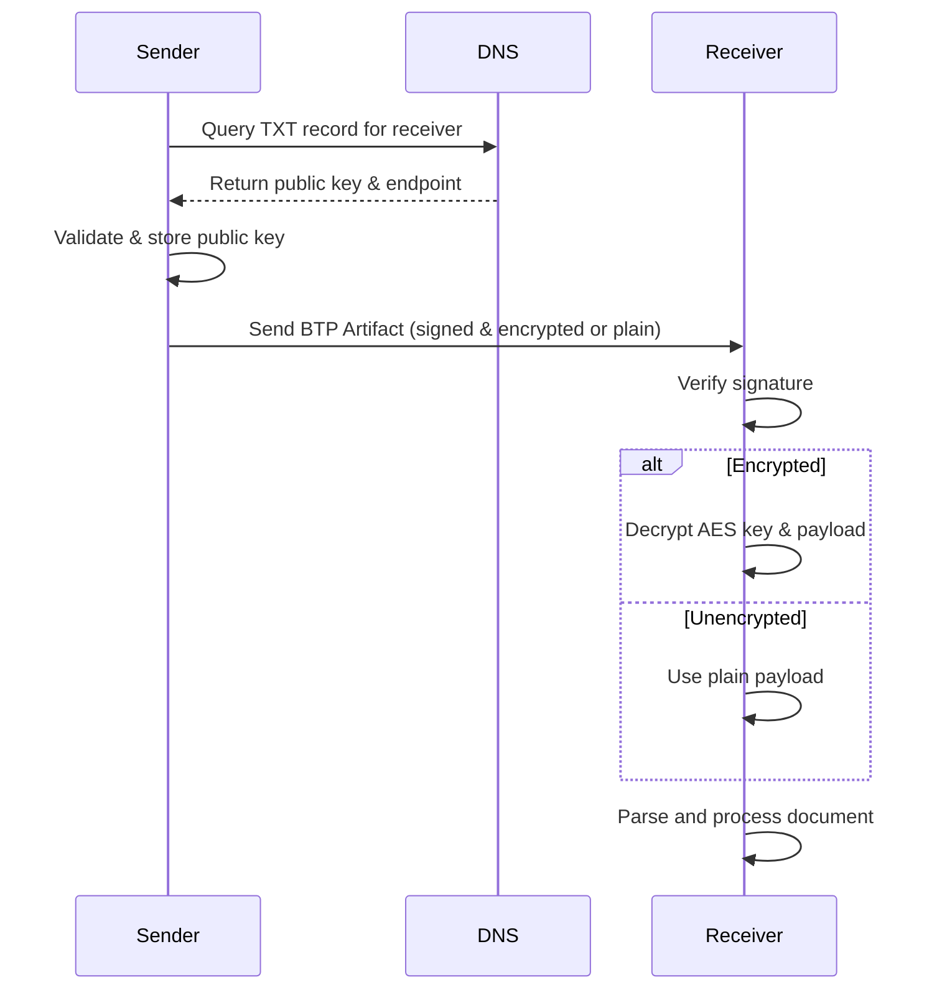

# Overview

BTPS (Billing Trust Protocol Secure) uses modern cryptographic techniques to ensure the confidentiality, integrity, and authenticity of all messages exchanged between parties. This system is designed to protect sensitive billing and financial data in transit and at rest.

## High-Level Workflow

## Key Features

- **End-to-End Encryption:** All messages are encrypted from sender to receiver, unless the trust record specifies unencrypted communication.
- **Multiple Algorithms:** Supports RSA, Ed25519, AES-256-CBC, and more.
- **Key Exchange:** Public keys are discovered via DNS and `.well-known` endpoints.
- **Message Signing:** Every message is signed by the sender and verified by the receiver.
- **Forward Secrecy:** Key rotation and revocation are supported for ongoing security.

## Encryption Modes

- **Standard Encryption:** Most messages are encrypted using a hybrid approach (asymmetric for key exchange, symmetric for payload).
- **Unencrypted Mode:** If the trust record between sender and receiver allows, messages may be sent unencrypted (encryption field is null in the artifact).
- **Configurable by Trust Record:** The trust relationship determines whether encryption is required, optional, or disabled for a given communication.

## High-Level Workflow

1. **Key Discovery:** Sender retrieves the receiver's public key from DNS or `.well-known`.
2. **Message Signing:** Sender signs the message with their private key.
3. **Encryption:** Message is encrypted using the receiver's public key (asymmetric) or a negotiated symmetric key, unless trust record allows unencrypted.
4. **Transmission:** Encrypted (or plain) message is sent to the receiver's inbox endpoint.
5. **Decryption & Verification:** Receiver decrypts the message (if encrypted) and verifies the sender's signature.

## Security Guarantees

- **Confidentiality:** Only the intended recipient can read the message (if encrypted).
- **Integrity:** Any tampering with the message is detectable.
- **Authenticity:** The sender's identity is cryptographically verified.

## Encryption/Decryption Logic

- The BTPS client uses the `signEncrypt` function to sign and encrypt outgoing artifacts. If encryption is not required (per trust record), the payload is sent as plain text and the `encryption` field is null.
- The receiver uses the `decryptVerify` function to verify the signature and decrypt the payload (if encrypted). If the artifact is unencrypted, only signature verification is performed.

> All sensitive data in BTPS is encrypted in transit and at rest, ensuring maximum security for billing and financial workflows.
