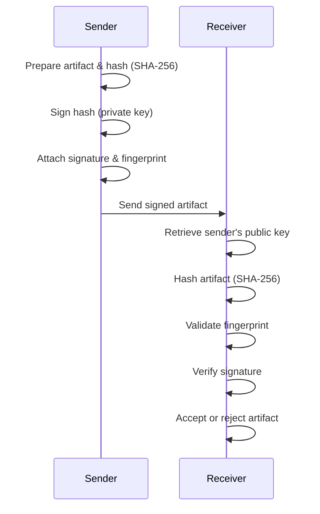

# Signature Signing & Verification in BTPS

BTPS uses digital signatures to ensure the authenticity and integrity of every message artifact exchanged between parties. This process is critical for preventing tampering and impersonation.

## Signature Workflow

### Signing (Sender Side)
1. **Payload Preparation:** The sender prepares the artifact (including metadata and payload).
2. **Hashing:** The sender computes a SHA-256 hash of the artifact.
3. **Signature Generation:** The sender signs the hash using their private key (RSA or Ed25519 planned).
4. **Fingerprint Calculation:** The sender's public key fingerprint is computed (SHA-256 of the public key DER).
5. **Signature Attachment:** The signature and fingerprint are attached to the artifact as the `signature` field.

### Verification (Receiver Side)
1. **Sender Identity Resolution:** The receiver parses the sender's identity and retrieves the sender's public key (from DNS or .well-known).
2. **Hashing:** The receiver computes a SHA-256 hash of the received artifact (excluding the signature field).
3. **Fingerprint Validation:** The receiver computes the fingerprint of the sender's public key and compares it to the artifact's fingerprint.
4. **Signature Verification:** The receiver verifies the signature using the sender's public key and the computed hash.
5. **Result:** If the signature is valid and the fingerprint matches, the artifact is accepted as authentic; otherwise, it is rejected.

## Sequence Diagram



## Example Signature Field

```json
{
  "signature": {
    "algorithm": "sha256",
    "value": "...",
    "fingerprint": "..."
  }
}
```

## Notes
- The signature covers the entire artifact (excluding the signature field and version itself).
- The fingerprint ensures the correct public key is used for verification.
- If signature verification fails, the artifact is rejected and an error is logged. 