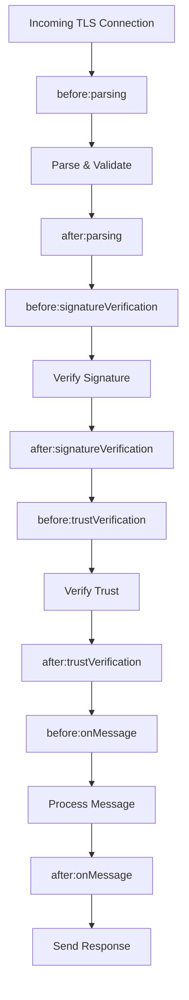

# Middleware System in BTPS Server

The BTPS Server SDK features a powerful, phase-based middleware system that lets you intercept, validate, transform, and control every step of the request lifecycle. Middleware is the primary way to add custom business logic, security, logging, and multi-tenant routing.

## Default Middleware: Quick Start

For rapid prototyping or small/medium deployments, the SDK provides a **default middleware set** that covers essential features out of the box:

- **IP-based rate limiting** (before parsing)
- **Identity-based rate limiting** (after parsing)
- **Signature and trust verification metrics**
- **Message processing metrics**
- **Error logging**

This default middleware is defined in [`defaultMiddleware.ts`](../../../../src/server/libs/defaultMiddleware.ts) and can be used as-is or as a starting point for your own configuration.

**How to use:**
- If you do not specify a custom middleware file, the server will not use this default middleware as its purely for inspection and implementation guide. However one can include this default middleware into the btps.middleware.mjs of the running server root folder
- To customize, you can import and extend it in your own middleware file:

```js
import { createDefaultMiddleware } from './src/server/libs/defaultMiddleware.js';

export default [
  ...createDefaultMiddleware(),
  // Add your custom middleware here
];
```

See [`example.btps.middleware.mjs`](../../../../example.btps.middleware.mjs) for a real-world example of extending and customizing the default middleware.

> **Note:** The default middleware is suitable for quick setup, development, and small-scale production. For large-scale or SaaS deployments, you should implement custom middleware that uses external services (e.g., Redis for distributed rate limiting, Prometheus for metrics) instead of in-memory state.

## Middleware Phases & Steps

Middleware can be registered for specific **phases** and **steps** in the request lifecycle:

| Phase   | Step                  | Description                        |
| ------- | --------------------- | ---------------------------------- |
| before  | parsing               | Before request is parsed/validated |
| after   | parsing               | After request is parsed/validated  |
| before  | signatureVerification | Before signature is verified       |
| after   | signatureVerification | After signature is verified        |
| before  | trustVerification     | Before trust is checked            |
| after   | trustVerification     | After trust is checked             |
| before  | onMessage             | Before message is processed        |
| after   | onMessage             | After message is processed         |
| before  | onError               | Before error is handled            |
| after   | onError               | After error is handled             |
| server  | onStart/onStop        | Server lifecycle hooks             |

## Middleware Execution Flow



## Middleware Types & Structure

A middleware definition is an object with the following structure:

```js
{
  stage: 'before' | 'after' | 'server', // Phase in the lifecycle
  type: 'parsing' | 'signatureVerification' | 'trustVerification' | 'onMessage' | 'onError' | 'onStart' | 'onStop', // Step or event
  priority?: number, // (Optional) Lower numbers run first
  config?: { ... }, // (Optional) Custom config for this middleware
  handler: async (ctx, res, next, context) => { ... }, // Middleware function
}
```

- **stage**: When the middleware runs (before/after a step, or server lifecycle)
- **type**: The specific step or event
- **priority**: (Optional) Controls execution order within the phase/step
- **config**: (Optional) Custom configuration for the middleware
- **handler**: The async function that implements your logic

## Writing Custom Middleware

Middleware is defined as an array of objects in a `.mjs` file (default: `btps.middleware.mjs`). Each object specifies the phase, step, and handler function.

**Example:**

```js
export default [
  // Block specific IPs
  {
    stage: 'before',
    type: 'parsing',
    handler: async (ctx, res, next) => {
      if (ctx.remoteAddress === '1.2.3.4') {
        res.sendError({ code: 403, message: 'Blocked IP' });
        return;
      }
      await next();
    },
  },
  // Log parsed artifacts
  {
    stage: 'after',
    type: 'parsing',
    handler: async (ctx, res, next) => {
      console.log('Parsed artifact:', ctx.artifact);
      await next();
    },
  },
  // Require signature
  {
    stage: 'before',
    type: 'signatureVerification',
    handler: async (ctx, res, next) => {
      if (!ctx.artifact || !ctx.artifact.signature) {
        res.sendError({ code: 400, message: 'Missing signature' });
        return;
      }
      await next();
    },
  },
];
```

## Queuing in Middleware

Middleware can be used to implement queuing for async processing, rate limiting, or deferred actions. For example, you can enqueue requests for later processing, or use a queue to smooth out bursts of traffic:

```js
import { enqueueArtifact } from './queue';

export default [
  {
    stage: 'before',
    type: 'onMessage',
    handler: async (ctx, res, next) => {
      await enqueueArtifact(ctx.artifact);
      res.sendResponse({ ok: true, message: 'Queued for processing', code: 202 });
      // Do not call next() to short-circuit further processing
    },
  },
];
```

## Middleware Context & API

Each handler receives:
- `ctx`: Request context (artifact, remoteAddress, etc.)
- `res`: Response context (sendError, sendResponse, etc.)
- `next`: Call to continue to the next middleware
- `context`: (Optional) Additional context (dependencies, config, server instance)

**Short-circuit:** Call `res.sendError()` or `res.sendResponse()` to stop processing and return a result.

## Loading & Ordering Middleware

- Middleware is loaded from the file specified by `middlewarePath` (default: `btps.middleware.mjs` in the root).
- Middleware is executed in the order listed for each phase/step.
- Use the `priority` field to control execution order (lower numbers run first).

## Server Lifecycle Middleware

You can register hooks for server start/stop:

```js
export default [
  // ...other middleware
];

export async function onServerStart() {
  // Initialize resources, connect to DB, etc.
}

export async function onServerStop() {
  // Cleanup resources, flush logs, etc.
}
```

## Best Practices

- **Keep middleware focused:** Each handler should do one thing (e.g., rate limit, log, validate).
- **Short-circuit on error:** Use `res.sendError()` to stop processing and return an error.
- **Order matters:** Middleware is executed in the order listed for each phase/step.
- **Test in isolation:** Write unit tests for complex handlers.
- **Use server-level hooks:** For metrics, health checks, or resource cleanup.

## Debugging Middleware

- Add logging to each handler to trace execution.
- Use the `onError` phase to catch and log errors.
- Test middleware with known-good and known-bad artifacts.
- Use health checks and metrics to monitor server readiness and performance.

---

Next: [Advanced Usage](./advancedUsages.md) | [Debugging](./debugging.md)
