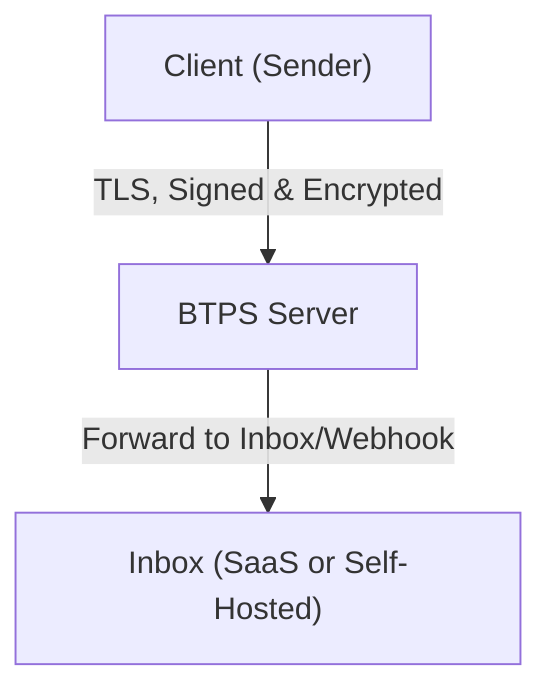
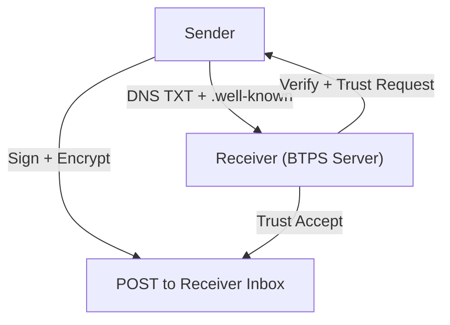

# BTPS Server SDK Overview

The **BTPS Server SDK** enables you to run a secure, multi-tenant BTPS server for business document exchange, trust management, and extensible business logic. It is designed for SaaS, enterprise, and large-scale deployments, supporting:

- **Multi-tenancy:** Serve many identities and trust relationships from a single server.
- **Custom trust stores:** Plug in any backend (JSON, SQL, NoSQL, cloud, etc.).
- **Flexible middleware:** Add validation, rate limiting, logging, and business logic.
- **TLS security:** All communication is encrypted and authenticated.
- **Event-driven and extensible:** Integrate with webhooks, custom handlers, and orchestration.

## Installation

```bash
npm install @btps/sdk
```

## High-Level Architecture

BTPS is a federated protocol for secure, trust-based document exchange. The server acts as a trust verifier, message router, and extensibility point for business logic.



- **Client:** Signs, encrypts, and sends documents
- **Server:** Verifies trust, validates, and routes documents
- **Inbox:** Final destination for processing and storage

## Core Features

- **Pluggable Trust Store:** Use file, SQL, NoSQL, or cloud backends
- **Phase-based Middleware:** Intercept and control every step of the request lifecycle
- **TLS-Only:** All connections are encrypted and authenticated
- **Event Hooks:** Integrate with webhooks, custom handlers, and metrics
- **Multi-Tenant Ready:** Route and isolate tenants with middleware and trust store logic

## Main Class: `BtpsServer`

```js
import { BtpsServer } from 'btps-sdk';

const server = new BtpsServer({
  port: 3443,
  trustStore, // Instance of a TrustStore (see advancedUsages)
  middlewarePath: './btps.middleware.mjs',
  onError: (err) => { /* handle errors */ },
  options: { /* TLS options */ },
});
```

## Protocol Flow



- **Identity Discovery:** DNS TXT records and .well-known endpoints
- **Trust Establishment:** Explicit, directional trust relationships
- **Secure Exchange:** Signed and encrypted artifacts
- **Document Processing:** Extraction and validation of business documents

## Security Posture

- **TLS 1.2+ required** for all connections
- **End-to-end encryption** using AES-256-CBC and RSA/Ed25519
- **Digital signatures** (SHA-256) for authenticity and integrity
- **Pluggable trust store** for secure, auditable trust management
- **Audit logging** and compliance support

## Extensibility

- **Middleware:** Add custom validation, logging, rate limiting, and business logic
- **Custom Trust Stores:** Integrate with any backend (see advancedUsages)
- **Webhooks:** Forward verified artifacts to SaaS apps or custom endpoints
- **Event Hooks:** Monitor, audit, and orchestrate server events

## Best Practices

- Always use a secure trust store and TLS configuration in production
- Use middleware for all custom logic and security controls
- Monitor, log, and audit all trust and message operations
- Regularly rotate keys and review trust relationships

---

Continue to [Setup](/docs/server/setup) to get started, or see [Advanced Usage](/docs/server/advanced-usages) for custom integrations.
